# CSS

從入門到精通

毛哥EM


---
layout: statement
class: say
---

<div class="eyebrow">文章教學</div>

這份簡報可以搭配文章一起服用

<div class="qr mt-8">

</div>

<div class="sub mt-4">
<a href="https://emtech.cc/course/frontend/css/">emtech.cc/course/frontend/css</a>
</div>

---
src: ../global/me.md
---

---

<div class="eyebrow">Recap</div>

## 一個網頁由三個東西組成

<div class="grid grid-cols-[1fr_300px] gap-10 items-center">
<div class="grid grid-cols-3 gap-4">
<div class="card">
<ph-skull class="card-icon" />
<h3>HTML</h3>
<p class="dim">骨架</p>
</div>
<div class="card" style="border-color: var(--purple)">
<ph-t-shirt class="card-icon" />
<h3>CSS</h3>
<p class="dim">外觀、衣服</p>
</div>
<div class="card">
<ph-brain class="card-icon" />
<h3>JavaScript</h3>
<p class="dim">行為、大腦</p>
</div>
</div>

</div>

<p class="lead !mt-6">今天我們來幫網頁穿衣服。</p>

---

<div class="eyebrow">Today</div>

## 今天會講什麼？

<div class="grid grid-cols-4 gap-4 mt-6">
<div class="card">
<ph-code class="card-icon" />
<h3>語法</h3>
<p class="dim">選擇器<br />權重<br />顏色與單位</p>
</div>
<div class="card">
<ph-paint-brush class="card-icon" />
<h3>裝飾</h3>
<p class="dim">文字、背景<br />漸層、邊框<br />圓角</p>
</div>
<div class="card">
<ph-bounding-box class="card-icon" />
<h3>盒子與排版</h3>
<p class="dim">margin、padding<br />box-sizing、display<br />Flexbox</p>
</div>
<div class="card">
<ph-stack class="card-icon" />
<h3>定位與動態</h3>
<p class="dim">position、transform<br />hover、transition<br />media query</p>
</div>
</div>

---
layout: section
---

<div class="eyebrow">Chapter 01</div>

# 環境建設

---

<div class="grid grid-cols-[1fr_1.4fr] gap-10 items-center">
<div>

<div class="eyebrow">Step 1</div>

## 開啟資料夾

用 VS Code 打開上禮拜的資料夾，或建一個新的。

<p class="dim !mt-4">macOS：<kbd>Ctrl</kbd> + <kbd>O</kbd><br />Windows：<kbd>Ctrl</kbd> + <kbd>K</kbd> 然後 <kbd>Ctrl</kbd> + <kbd>O</kbd></p>

</div>

</div>

---

<div class="grid grid-cols-[1fr_1.4fr] gap-10 items-center">
<div>

<div class="eyebrow">Step 2</div>

## 建立 HTML 檔

一樣建一個 HTML 檔，輸入 <code>!</code> 再按 <kbd>Tab</kbd>。

</div>

</div>

---

<div class="eyebrow">Step 3</div>

## 加一個標題和 `<style>`

<div class="grid grid-cols-[1.4fr_1fr] gap-8 items-center">

```html {9-10}
<!doctype html>
<html lang="en">
	<head>
		<meta charset="UTF-8" />
		<meta name="viewport" content="width=device-width, initial-scale=1.0" />
		<title>Document</title>
	</head>
	<body>
		<h1>我是標題</h1>
		<style></style>
	</body>
</html>
```

<div>
<p class="lead">等一下 CSS 都寫在 <code>&lt;style&gt;</code> 之間。</p>
<p class="dim">點右下角的 <strong>Go Live</strong> 開始寫 CSS！</p>
</div>
</div>

---

<div class="eyebrow">Tip</div>

## VS Code 放左邊，瀏覽器放右邊

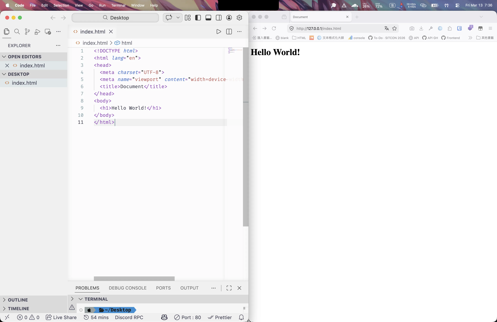

<p class="dim text-center !mt-4">Windows：<kbd>Win</kbd> + <kbd>←</kbd>　macOS：<kbd>🌐</kbd> + <kbd>⌃</kbd> + <kbd>←</kbd></p>

---
layout: section
---

<div class="eyebrow">Chapter 02</div>

# 簡單的 CSS

---

<div class="eyebrow">Hello CSS</div>

## 讓標題變藍色

<div class="grid grid-cols-2 gap-8 items-center">

```css
h1 {
	color: blue;
}
```

<div class="preview">
<h1 style="color: blue">我是標題</h1>
</div>
</div>

<p class="dim !mt-6">試試看改成 red、green、yellow。滑鼠移到顏色上，VS Code 還會給你調色盤。</p>

---

<div class="eyebrow">Syntax</div>

## CSS 的結構

<div class="grid grid-cols-2 gap-10 items-center">

```css
選擇器 {
	屬性: 屬性值;
}
```

<div class="table-clean">

| 部分    | 英文     | 意思       |
| ------- | -------- | ---------- |
| `h1`    | selector | 要改誰     |
| `color` | property | 要改什麼   |
| `blue`  | value    | 要改成什麼 |

</div>
</div>

---

<div class="eyebrow">Where</div>

## CSS 寫在哪裡？

<div class="grid grid-cols-2 gap-6 mt-2">
<div class="card">
<h3>寫在 <code>&lt;style&gt;</code> 裡</h3>

```html
<style>
	h1 {
		color: red;
	}
</style>
```

<p class="dim">通常放在 <code>&lt;head&gt;</code> 裡面。</p>
</div>
<div class="card">
<h3>獨立成 CSS 檔再連結</h3>

```html
<link rel="stylesheet" href="style.css" />
```

<p class="dim">多個頁面共用同一份樣式，專案大了一定這樣做。</p>
</div>
</div>

---
layout: section
---

<div class="eyebrow">Chapter 03</div>

# 選擇器與權重

---

<div class="eyebrow">Selector</div>

## 常見選擇器

<div class="table-clean table-tight">

| 選擇器                    | 名稱     | 選到誰                      |
| ------------------------- | -------- | --------------------------- |
| `h1`                      | 元素     | 所有 `<h1>`                 |
| `.card`                   | class    | 所有 `class="card"`         |
| `#logo`                   | id       | `id="logo"` 的那一個        |
| `nav a`                   | 後代     | `<nav>` 裡面所有的 `<a>`    |
| `ol > li`                 | 親代     | `<ol>` 底下第一層的 `<li>`  |
| `nav, a`                  | 群組     | 所有 `<nav>` 還有所有 `<a>` |
| `h1 + p`                  | 相鄰兄弟 | `<h1>` 正後方那一個 `<p>`   |
| `h1 ~ p`                  | 一般兄弟 | `<h1>` 後面所有的 `<p>`     |
| `a[href="https://x.com"]` | 屬性     | 連到 X 首頁的連結           |

</div>

<p class="muted !mt-3">屬性還能比對一部分：<code>*=</code> 包含、<code>^=</code> 開頭是、<code>$=</code> 結尾是。</p>

---
layout: statement
class: say
---

<div class="eyebrow">Specificity</div>

兩行 CSS 在描述同一個元素，瀏覽器要聽誰的？

---

<div class="eyebrow">Rule 1</div>

## 權重越高，就越有權力

<div class="grid grid-cols-2 gap-10 items-center">
<div>

<Steps class="mt-2" :cols="1" mode="auto" :items="[{ t: 'ID 選擇器', d: '#title' }, { t: '類別、屬性、偽類', d: '.title、[href]、:hover' }, { t: '元素、偽元素', d: 'h1、::before' }, { t: '* 沒有權級', d: '' }]" />

</div>
<div>

<blockquote>你女朋友說你很醜，早餐店阿姨說你是帥哥，那麼你應該很醜，因為女朋友永遠是對的。</blockquote>

<p class="dim !mt-6">權重可以相加，VS Code 滑鼠移上去也會提示。</p>

</div>
</div>

---

<div class="eyebrow">Example</div>

## 一個權重超高的宣告

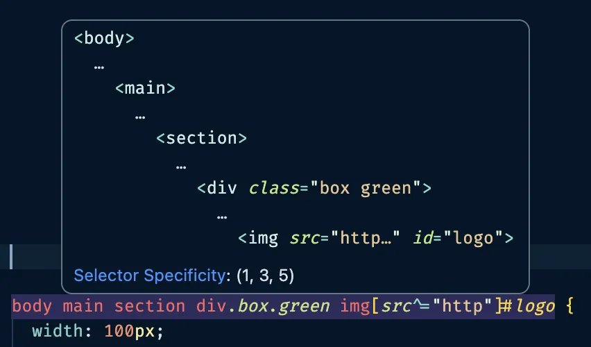

<p class="dim text-center !mt-4">可以用 <a href="https://specificity.keegan.st/">Specificity Calculator</a> 玩玩看。</p>

---

<div class="eyebrow">Rule 2</div>

## 權重相等，後寫的蓋過先寫的

<div class="grid grid-cols-2 gap-10 items-center">

```css
h1 {
	color: red;
}

h1 {
	color: green; /* 這個贏 */
}
```

<div>
<p class="lead">剛交往時說很愛你，後來你變醜了就不愛了。以後面的為主。</p>
<p v-click class="dim !mt-6"><code>!important</code> 可以硬蓋過去，但最後你會變成每一行都在尖叫，又吵又亂又更難蓋。</p>
</div>
</div>

---
layout: section
---

<div class="eyebrow">Chapter 04</div>

# 顏色與單位

---

<div class="eyebrow">Color</div>

## 同一個紅色，七種寫法

```css
h1 {
	color: red; /* 顏色名稱 */
	color: #ff0000; /* 16 進位 HEX 碼 */
	color: rgb(255, 0, 0);
	color: rgba(255, 0, 0, 1); /* 加上 A 透明度 */
	color: hsl(0, 100%, 50%); /* 色相、飽和度、亮度 */
	color: hsla(0, 100%, 50%, 1);
	color: color(display-p3 1 0 0 / 1); /* RGB 表示不了的顏色 */
}
```

<p class="muted !mt-3">最常見的是 HEX 碼，可以直接從設計圖複製。</p>

---

<div class="eyebrow">HEX</div>

## 十六進位 Hexadecimal

<div class="text-center mt-6">
<div class="big mono">#<span style="color: #ff5555">ff</span><span style="color: #50fa7b">00</span><span style="color: #8be9fd">00</span></div>
<p class="dim !mt-2"><span style="color: #ff5555">R</span>、<span style="color: #50fa7b">G</span>、<span style="color: #8be9fd">B</span> 各兩位數，00 到 ff（0 到 255）</p>
</div>

<div class="grid grid-cols-3 gap-4 mt-8">
<div class="card text-center"><div class="mono">#000000</div><p class="dim">黑色</p></div>
<div class="card text-center"><div class="mono">#ffffff</div><p class="dim">白色</p></div>
<div class="card text-center"><div class="mono">#ff0000</div><p class="dim">紅色</p></div>
</div>

---

<div class="eyebrow">HSL</div>

## 色相、飽和度、亮度

<div class="grid grid-cols-[1fr_1.4fr] gap-10 items-center">
<div class="table-clean">

| 字母 | 意思            | 範圍     |
| ---- | --------------- | -------- |
| H    | hue 色相        | 0 ~ 360  |
| S    | saturation 飽和 | 0 ~ 100% |
| L    | lightness 亮度  | 0 ~ 100% |

</div>
<div>
<div class="text-sm muted mb-1">H：0 紅、120 綠、240 藍（拉拉看）</div>
<div style="height: 44px; border-radius: 10px; background: linear-gradient(90deg, hsl(0 100% 50%), hsl(60 100% 50%), hsl(120 100% 50%), hsl(180 100% 50%), hsl(240 100% 50%), hsl(300 100% 50%), hsl(360 100% 50%))"></div>
<input type="range" min="0" max="360" value="0" class="w-full mt-2" oninput="this.parentElement.querySelector('.hsl-out').style.background = `hsl(${this.value} 100% 50%)`; this.parentElement.querySelector('.hsl-val').textContent = `hsl(${this.value}, 100%, 50%)`" />
<div class="flex items-center gap-4 mt-2">
<div class="hsl-out" style="width: 64px; height: 64px; border-radius: 12px; background: hsl(0 100% 50%)"></div>
<span class="hsl-val mono">hsl(0, 100%, 50%)</span>
</div>
<div class="text-sm muted mt-4 mb-1">S：飽和度</div>
<div style="height: 20px; border-radius: 6px; background: linear-gradient(90deg, hsl(0 0% 50%), hsl(0 100% 50%))"></div>
<div class="text-sm muted mt-3 mb-1">L：亮度</div>
<div style="height: 20px; border-radius: 6px; background: linear-gradient(90deg, hsl(0 100% 0%), hsl(0 100% 50%), hsl(0 100% 100%))"></div>
</div>
</div>

---

<div class="eyebrow">Size</div>

## 大小單位

<div class="grid grid-cols-[1.2fr_1fr] gap-8 items-center">

```css
h1 {
	font-size: 100px; /* 像素 */
	font-size: 10rem; /* 根元素字體大小 */
	font-size: 10em; /* 父元素字體大小 */
	font-size: 10vw; /* 螢幕寬度的 10% */
	font-size: 10vh; /* 螢幕高度的 10% */
	font-size: 10vmin; /* 寬高比較小的那個 */
	font-size: 10vmax; /* 寬高比較大的那個 */
	font-size: 10%;
}
```

<div>
<p class="lead">預設字體大小通常是 <code>16px</code>。</p>
<p class="dim !mt-4">百分比在不同地方意思不太一樣：</p>
<ul class="dim">
<li><code>width</code>、<code>height</code> 的 % 基準是父層</li>
<li><code>line-height</code> 以本身文字為基準</li>
</ul>
</div>
</div>

---
layout: section
---

<div class="eyebrow">Chapter 05</div>

# 文字與背景

---

<div class="eyebrow">Text</div>

## 文字裝飾：語法直接全上

<div class="grid grid-cols-[1.4fr_1fr] gap-8 items-center code-sm">

```css
h1 {
	color: red; /* 顏色 */
	font-size: 32px; /* 字體大小 */
	letter-spacing: 10px; /* 字距 */
	line-height: 1.5; /* 行高，通常用倍數 */
	font-weight: 500; /* 粗細，預設 400 */
	text-decoration: underline; /* 底線 */
	font-style: italic; /* 斜體 */
	opacity: 0.5; /* 不透明度 */
	text-align: center; /* 對齊方向 */
	font-family: arial, sans-serif; /* 字體，沒有就往後找 */
}
```

<div class="preview text-center">
<h1 style="color: red; font-size: 32px; letter-spacing: 10px; line-height: 1.5; font-weight: 500; text-decoration: underline; font-style: italic; opacity: 0.5; font-family: arial, sans-serif">Hello</h1>
</div>
</div>

---

<div class="eyebrow">font-weight / text-decoration</div>

## 最常用的兩個

<div class="grid grid-cols-2 gap-6 code-sm">
<div class="card">
<h3>font-weight 粗細</h3>

```css
font-weight: normal; /* = 400 */
font-weight: bold; /* = 700 */
font-weight: lighter;
font-weight: bolder;
font-weight: 100;
font-weight: 900;
```

</div>
<div class="card">
<h3>text-decoration 裝飾線</h3>

```css
text-decoration: underline;
text-decoration: overline red;
text-decoration: none; /* 去掉連結醜醜的底線 */
text-decoration-color: #ff00ff;
```

</div>
</div>

---

<div class="eyebrow">Background</div>

## 背景顏色與寬高

<div class="grid grid-cols-[1fr_1fr_220px] gap-6 items-center">

```html
<div></div>
```

```css
div {
	background-color: burlywood;
	width: 200px;
	height: 200px;
}
```

<div style="width: 200px; height: 200px; background-color: burlywood; border-radius: 4px"></div>
</div>

<p class="muted !mt-6">這個顏色是高大結實的木頭。</p>

---

<div class="eyebrow">Background Image</div>

## 背景圖片

<div class="code-sm">

```css
background-image: url("image.webp");
background-repeat: no-repeat;
background-size: cover; /* 不管有沒有全部進去，塞滿就對了 */
background-size: contain; /* 全部塞進去 */

background-position: top left;
background-position: 20% 40%; /* 從左上開始算 */

background-attachment: scroll; /* 不動但可以往下滾 */
background-attachment: fixed; /* 卡住不動 */
background-attachment: local; /* 一起動 */

background: no-repeat url("image.webp"); /* 縮寫 */
```

</div>

---

<div class="eyebrow">background-size</div>

## contain 與 cover

<div class="grid grid-cols-2 gap-8 mt-4">
<div>
<div class="mono mb-2">background-size: contain;</div>
<video class="w-full rounded-xl" style="height: 280px; border: 2px solid var(--hairline-strong); background: #111" autoplay muted playsinline loop src="./img/long.webm"></video>
<p class="dim !mt-2">整張圖都看得到，可能留白。</p>
</div>
<div>
<div class="mono mb-2">background-size: cover;</div>
<video class="w-full rounded-xl" style="height: 280px; border: 2px solid var(--hairline-strong); object-fit: cover; object-position: top" autoplay muted playsinline loop src="./img/long.webm"></video>
<p class="dim !mt-2">塞滿，超出去的切掉。</p>
</div>
</div>

---

<div class="eyebrow">Gradient</div>

## 漸層

<div class="grid grid-cols-[1.3fr_1fr] gap-8 items-center">
<div>

```css
background: linear-gradient(方向, 顏色 位置, 顏色 位置);
```

<div class="grid grid-cols-2 gap-4 mt-6">
<div>
<div class="mono text-xs mb-1">linear-gradient(90deg, red, blue)</div>
<div style="height: 70px; border-radius: 10px; background: linear-gradient(90deg, red, blue)"></div>
</div>
<div>
<div class="mono text-xs mb-1">(45deg, red 50%, blue 50%)</div>
<div style="height: 70px; border-radius: 10px; background: linear-gradient(45deg, red 50%, blue 50%)"></div>
</div>
<div>
<div class="mono text-xs mb-1">radial-gradient(red, blue)</div>
<div style="height: 70px; border-radius: 10px; background: radial-gradient(red, blue)"></div>
</div>
<div>
<div class="mono text-xs mb-1">conic-gradient(red, yellow, blue, red)</div>
<div style="height: 70px; border-radius: 10px; background: conic-gradient(red, yellow, blue, red)"></div>
</div>
</div>

</div>
<div class="text-center">
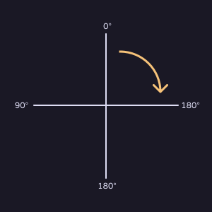
<p class="dim text-sm !mt-2">12 點是 0 度，順時針旋轉</p>
</div>
</div>

<p class="muted !mt-4">位置重疊（50% 接 50%）就會變成一刀切開的硬邊。</p>

---
layout: section
---

<div class="eyebrow">Chapter 06</div>

# 盒子

---

<div class="eyebrow">Border</div>

## border 邊框

<div class="grid grid-cols-[1.3fr_1fr] gap-8 items-center">

```css
border-top: solid 10px red;
border-bottom: solid 10px red;
border-left: solid 10px red;
border-right: solid 10px red;

border-style: solid; /* 花邊，solid 是直線 */
border-width: 10px;
border-color: #00ff00;
border: solid 10px red; /* 縮寫 */
```

<div class="flex justify-center">
<div style="width: 160px; height: 160px; background: burlywood; border: solid 10px red"></div>
</div>
</div>

---

<div class="eyebrow">border-radius</div>

## 圓角

<div class="grid grid-cols-[1.3fr_1fr] gap-8 items-center">
<div>

```css
border-radius: 16px;
border-radius: 50%;

border-radius: 四個角;
border-radius: 左上右下 右上左下;
border-radius: 左上 右上 右下 左下;
border-top-left-radius: 10%;
```

<p class="dim !mt-4">正方形給 50% 的圓角，就變成圓形。超過一半的值（例如 9999px）會被限制在最大。</p>

</div>
<div class="flex justify-center items-center gap-6">
<div style="width: 120px; height: 120px; background: burlywood; border-radius: 16px"></div>
<div v-click style="width: 120px; height: 120px; background: burlywood; border-radius: 50%"></div>
</div>
</div>

---
clicks: 1
---

<div class="eyebrow">margin</div>

## margin 外距：元素與元素之間

<div class="grid grid-cols-2 gap-10 items-center">

```css
div {
	margin: 16px; /* 四邊 */
	margin: 16px 32px; /* 上下 左右 */
	margin: 16px 32px 24px; /* 上 左右 下 */
	margin: 16px 32px 24px 8px; /* 上右下左 */
	margin-top: 16px; /* 單邊 */
}
```

<div class="flex flex-col items-center">
<div class="transition-all duration-500" :style="{ margin: $clicks ? '20px 0' : '0' }" style="width: 260px; height: 70px; background: #40a3e7; border-radius: 4px"></div>
<div class="transition-all duration-500" :style="{ margin: $clicks ? '20px 0' : '0' }" style="width: 260px; height: 70px; background: #40a3e7; border-radius: 4px"></div>
<p class="muted text-sm !mt-4">{{ $clicks ? 'margin: 20px' : 'margin: 0' }}</p>
</div>
</div>

---

<div class="eyebrow">padding</div>

## padding 內距：容器與裡面內容之間

<div class="grid grid-cols-2 gap-10 items-center">

```css
div {
	background-color: lightblue;
	margin: 32px 16px;
}

#box {
	padding: 16px;
}
```

<div>
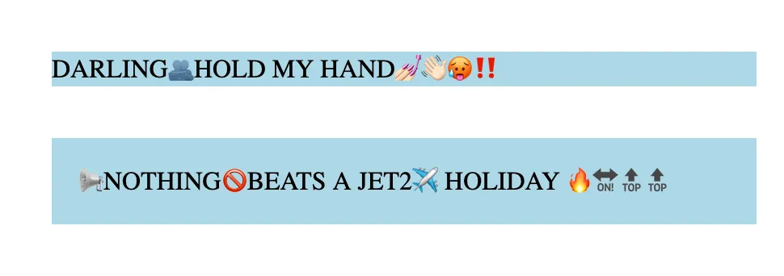
<p class="dim text-center !mt-2">加了 padding 明顯好看又好讀。</p>
</div>
</div>

---
layout: statement
class: say
---

<div class="eyebrow">box-sizing</div>

這是一個幾乘幾的地獄門呢？

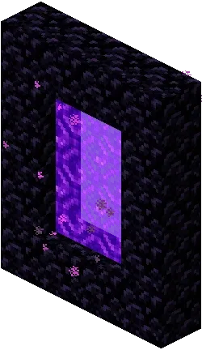

<p class="sub !mt-2">圖片來源：<a href="https://minecraft.fandom.com/zh/wiki/%E4%B8%8B%E7%95%8C%E4%BC%A0%E9%80%81%E9%97%A8?variant=zh-tw">Minecraft Wiki</a></p>

---

<div class="eyebrow">content-box</div>

## 兩個都是 100px，為什麼不一樣大？

<div class="grid grid-cols-[1fr_1fr_200px] gap-6 items-center">

```html
<div></div>
<br />
<div id="box"></div>
```

```css
div {
	width: 100px;
	height: 100px;
	background-color: purple;
}

#box {
	border: 20px solid black;
}
```

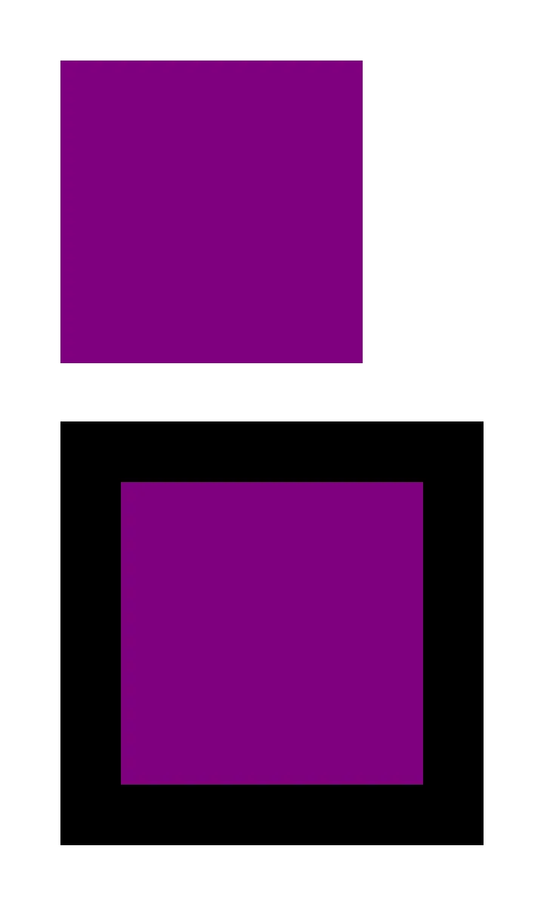
</div>

<p class="dim !mt-4">因為預設寬高<strong>不包含邊框</strong>，排版時很不直覺。</p>

---

<div class="eyebrow">border-box</div>

## 請你把 border 也算進去

<div class="grid grid-cols-[1.3fr_200px] gap-10 items-center">
<div>

```css
box-sizing: content-box; /* 預設，只算內容 */
box-sizing: border-box; /* 包含 padding 和邊框 */
```

<p class="lead !mt-6">所以大家通常一開始就會設定：</p>

```css
* {
	box-sizing: border-box;
}
```

</div>
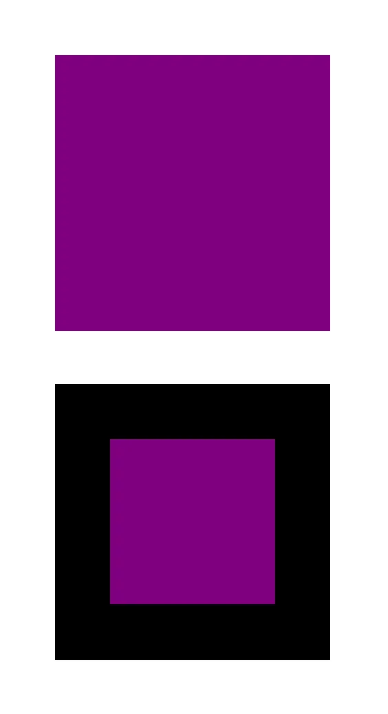
</div>

---

<div class="eyebrow">outline</div>

## outline：不佔空間的外框

<div class="grid grid-cols-[1.3fr_1fr] gap-8 items-center">

```css
#box {
	width: 100px;
	height: 100px;
	background-color: lightblue;
	border: 20px solid lightgreen;
	outline: 20px solid lightcoral;
}
```

<div>
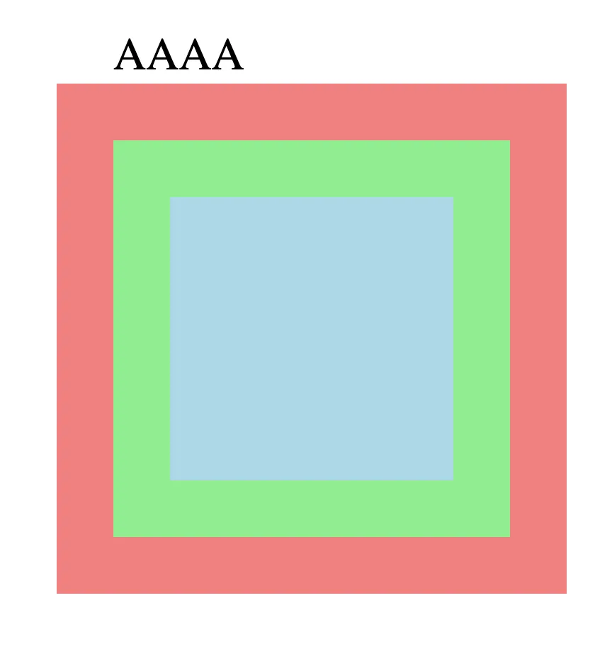
<p class="dim !mt-2">outline 不佔任何空間，所以把 BBBB 蓋過去了。也不能只設定單邊。</p>
</div>
</div>

---
layout: section
---

<div class="eyebrow">Chapter 07</div>

# display 你要怎麼佈局

---

<div class="eyebrow">Block vs Inline</div>

## 區塊元素與行內元素

<div class="grid grid-cols-2 gap-8 items-center">
<div>
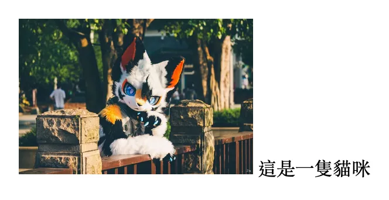
<p class="dim text-center !mt-2"><code>&lt;img&gt;</code> 預設是行內元素，跟文字擠在一起</p>
</div>
<div v-click>
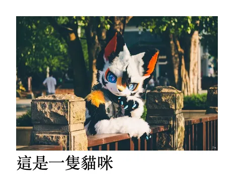
<p class="dim text-center !mt-2"><code>img { display: block; }</code> 自己佔滿一排</p>
</div>
</div>

<p class="muted !mt-4 text-center">圖：凌汐 Jeffrey</p>

---

<div class="eyebrow">display</div>

## 常見的 display 值

<div class="table-clean">

| 值             | 效果                             |
| -------------- | -------------------------------- |
| `inline`       | 像文字一樣左到右排，不能決定寬高 |
| `block`        | 佔滿整排，下一個東西會換行       |
| `inline-block` | 可以設寬高，但一樣左到右排       |
| `none`         | 整個隱藏，連空間都不佔           |
| `flex`         | 裡面的東西依序左到右或上到下排   |
| `grid`         | 裡面的東西像表格一樣整齊排列     |

</div>

---
layout: section
---

<div class="eyebrow">Chapter 08</div>

# Flexbox 超好用的容器

<p class="muted">學會它，你幾乎就能排出任何版面。</p>

---

<div class="eyebrow">Setup</div>

## 先做一個盒子裝四個方塊

<div class="grid grid-cols-[1fr_1fr_1.1fr] gap-6 items-center">

```html
<section>
	<div></div>
	<div></div>
	<div></div>
	<div></div>
</section>
```

```css
section {
	background: #191d88;
	padding: 5px;
}

div {
	width: 100px;
	height: 100px;
	background: #ffc436;
	margin: 20px;
}
```

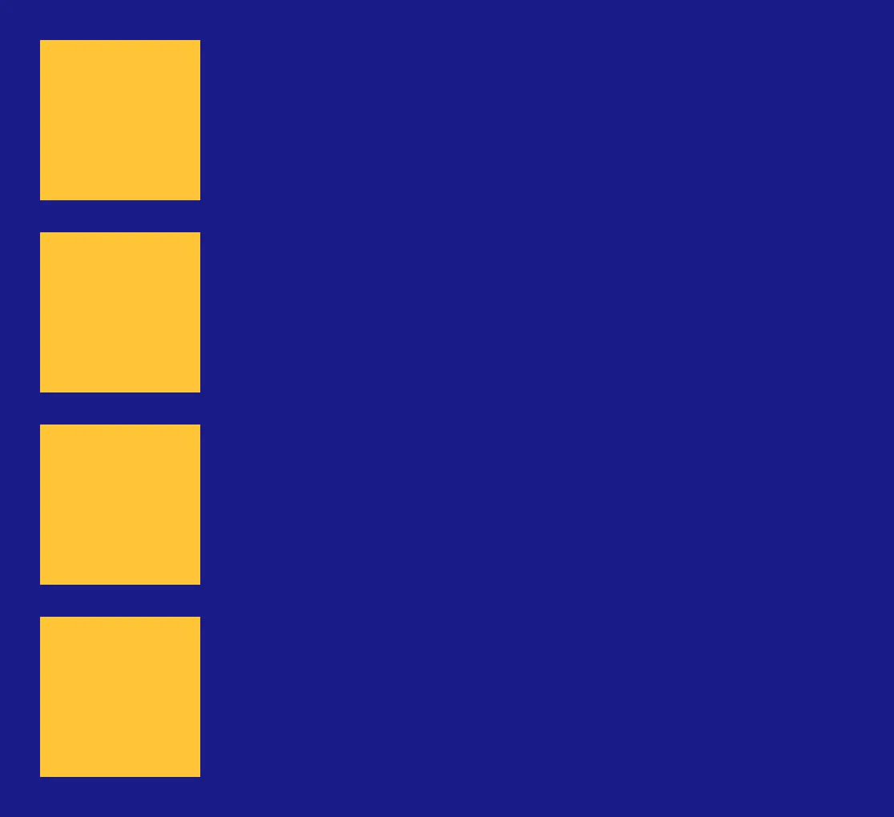
</div>

<p class="muted !mt-3">Emmet：<code>section>div*4</code>；<code>w100</code>、<code>bg</code>、<code>m20</code> 也都能 Tab 展開。</p>

---

<div class="eyebrow">display: flex</div>

## 在外容器加上 `display: flex`

<div class="grid grid-cols-[1fr_1.4fr] gap-8 items-center">

```css {4}
section {
	background: #191d88;
	padding: 5px;
	display: flex;
}
```

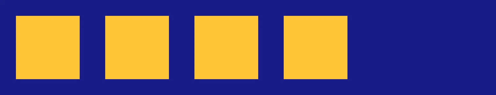
</div>

<p class="dim !mt-6">外面藍色的叫<strong>外容器</strong>，裡面黃色的叫<strong>內容器</strong>。在外容器設定裡面的東西怎麼排。</p>

---

<div class="eyebrow">flex-direction</div>

## 排序方向

<div class="grid grid-cols-[1fr_1.2fr] gap-8 items-center">

```css
flex-direction: row; /* 預設左到右 */
flex-direction: row-reverse; /* 右到左 */
flex-direction: column; /* 上到下 */
flex-direction: column-reverse; /* 下到上 */
```

<div>
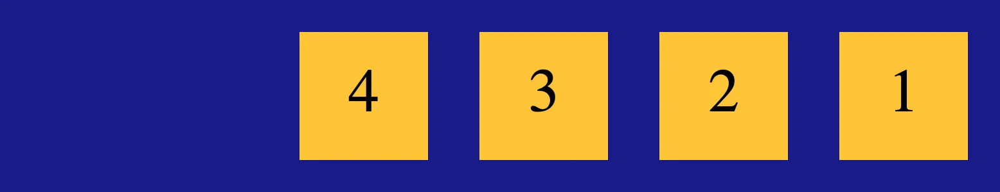
<p class="dim text-center !mt-2 mono text-sm">row-reverse</p>
</div>
</div>

---

<div class="eyebrow">flex-wrap</div>

## 超過換行

<div class="grid grid-cols-2 gap-8 items-start">
<div>
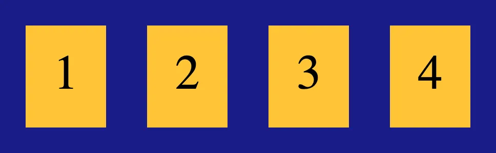
<p class="dim text-center !mt-2">硬擠成一排，正方形都被壓扁了</p>
</div>
<div v-click>
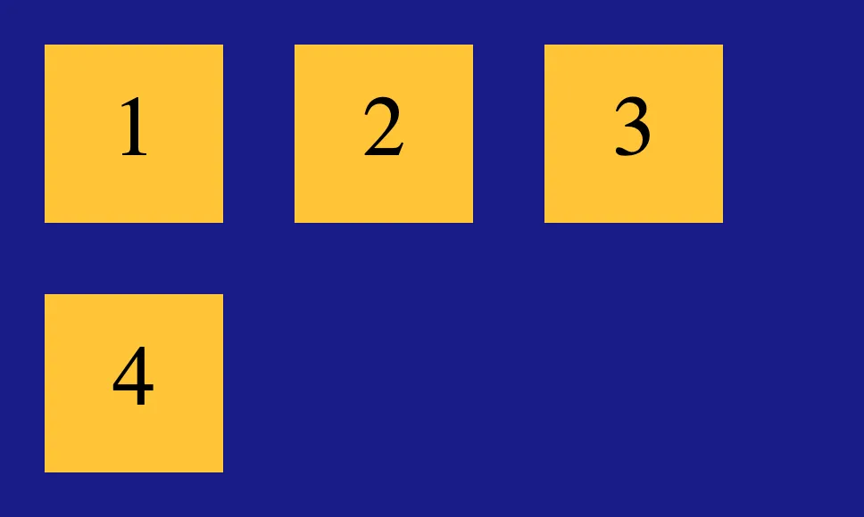
<p class="dim text-center !mt-2 mono text-sm">flex-wrap: wrap;</p>
</div>
</div>

```css
flex-wrap: nowrap; /* 不換行 */
flex-wrap: wrap; /* 太寬換行 */
flex-wrap: wrap-reverse; /* 換行但從下到上 */
```

---

<div class="eyebrow">justify-content</div>

## 主軸對齊

<div class="grid grid-cols-[1fr_1.3fr] gap-8 items-center">

```css
justify-content: flex-start; /* 靠左 */
justify-content: flex-end; /* 靠右 */
justify-content: center; /* 置中 */
justify-content: space-between; /* 均分 */
justify-content: space-around; /* 環繞均分 */
```


</div>

<p class="muted !mt-2">如果設定 <code>flex-direction: column</code>，就變成垂直方向。</p>

---

<div class="eyebrow">align-items / align-content</div>

## 交叉軸對齊

<div class="grid grid-cols-[1fr_1.3fr] gap-8 items-center">
<div>

```css
align-items: flex-start;
align-items: flex-end;
align-items: center;
align-items: stretch; /* 拉到一樣高 */
align-items: baseline; /* 對齊文字 */
```

<p class="dim !mt-4"><code>align-content</code> 是多行版本；<code>align-self</code> 讓單一元素不乖乖排隊。</p>

</div>

</div>

---

<div class="eyebrow">flex-grow / shrink / basis</div>

## 空間要怎麼分？

<div class="grid grid-cols-[1fr_1.2fr] gap-8 items-center">
<div>

<div class="card mb-3">
<h3>flex-grow：剩下的空間給誰？</h3>
<p class="dim">預設 0。1 以上依比例分剩下的空間。</p>
</div>
<div class="card mb-3">
<h3>flex-shrink：空間不夠壓榨誰？</h3>
<p class="dim">預設 1。設成 0 就不會被壓縮。</p>
</div>
<div class="card">
<h3>flex-basis：你怎麼看我</h3>
<p class="dim">「雖然我只有 5 公分，但請把我當 30 公分來排。」</p>
</div>

</div>

</div>

---

<div class="eyebrow">order</div>

## 調整順序

<div class="grid grid-cols-2 gap-8 items-center">

```css
order: -1; /* 放到最前面 */
order: 1; /* 放到最後面 */
order: 5; /* 排在 1 的後面 */
```

<div>
<p class="lead">還不熟 flex？</p>
<p class="dim">去玩 <a href="https://flexboxfroggy.com/#zh-tw">Flexbox Froggy</a>，用遊戲學 flex。提示可以直接點，不用慢慢打。</p>
</div>
</div>

---
layout: statement
class: say
---

<div class="eyebrow">中場練習</div>

用今天學到的語法，做一個 Google 首頁

<p class="sub !mt-4">重點在排版。按鈕陰影和顏色可以打開開發者工具偷看。</p>

<div class="flex justify-center gap-4 mt-8">
<a class="pill" href="https://sysh-tech-volunteer.github.io/Web-Design-Camp/practice/google.html">範例網站</a>
<a class="pill" href="https://github.com/SYSH-Tech-Volunteer/Web-Design-Camp/blob/main/practice/google.html">原檔 HTML</a>
<a class="pill" href="https://github.com/SYSH-Tech-Volunteer/Web-Design-Camp/blob/main/practice/google.css">原檔 CSS</a>
</div>

---
layout: section
---

<div class="eyebrow">Chapter 09</div>

# Position 東西放哪

---

<div class="grid grid-cols-[1fr_1.3fr] gap-10 items-center">
<div>

<div class="eyebrow">Out of flow</div>

## 有時候不希望東西好好排

<ul class="lead">
<li>右下角的客服按鈕</li>
<li>永遠固定在上方的選單</li>
<li>蓋在畫面上的彈窗</li>
</ul>

```css
position: 屬性;
```

</div>

</div>

---

<div class="eyebrow">Static & Relative</div>

## static 不動，relative 解鎖偏移

<div class="grid grid-cols-[1.2fr_1fr] gap-8 items-center">
<div>

<p class="dim"><code>static</code>：預設值，該在哪就在哪。</p>
<p class="dim"><code>relative</code>：可以用 <code>top</code>、<code>bottom</code>、<code>left</code>、<code>right</code> 偏移，但<strong>還佔著原本的位置</strong>。</p>

```css
#purple {
	position: relative;
	left: 30px;
	top: -50px;
}
```

</div>
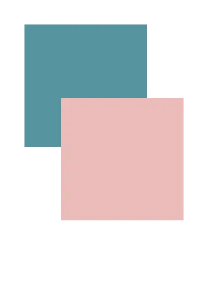
</div>

---

<div class="eyebrow">Absolute</div>

## absolute：像貼紙一樣貼上去

<div class="grid grid-cols-[1.2fr_1fr] gap-8 items-center">
<div class="code-sm">

```html
<div class="container">
	<div class="purple"></div>
	<div class="green"></div>
</div>
```

```css
.container {
	background-color: #e0def4;
	margin-top: 130px;
}
.purple {
	position: absolute;
	left: 30px;
	top: 0;
}
```

</div>
<div>
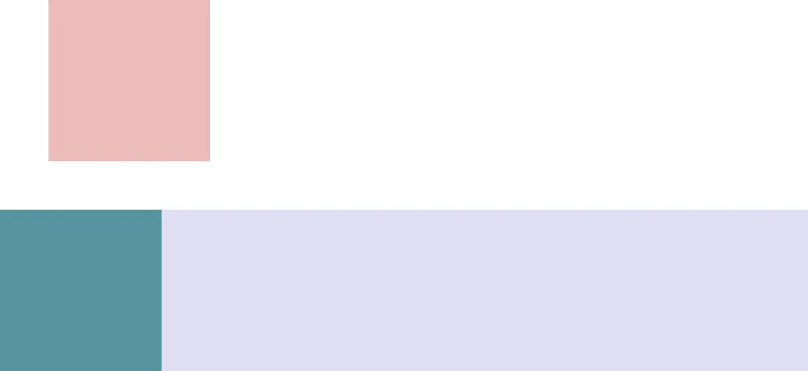
<p class="dim !mt-2">不再佔原本的位置，逃到整個 <code>&lt;body&gt;</code> 的最上面。</p>
</div>
</div>

---

<div class="eyebrow">Absolute + Relative</div>

## 定位點是最近的已定位祖先

<div class="grid grid-cols-[1.2fr_1fr] gap-8 items-center">
<div>

```css {4}
.container {
	background-color: #e0def4;
	margin-top: 130px;
	position: relative;
}
```

<p class="dim !mt-4">幫外層加上 <code>position: relative</code>，粉紅色方塊就改以紫色容器的左上角為定位點。</p>

</div>
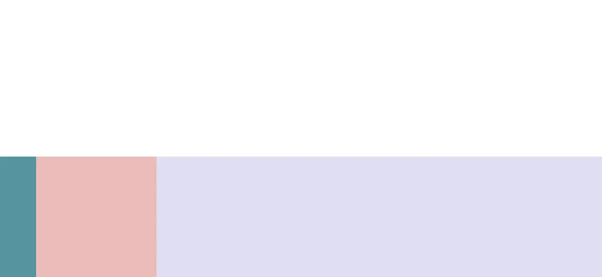
</div>

---

<div class="eyebrow">Fixed</div>

## fixed：卡在畫面上

<div class="grid grid-cols-[1fr_1.2fr] gap-8 items-center">
<div class="code-sm">

```css
nav {
	width: 100%;
	height: 100px;
	background: #e0def4;
	position: fixed;
	top: 0;
	left: 0;
}
```

<p class="dim">以螢幕左上角為定位點，怎麼滾都待在那。常見：回到頂端按鈕、煩人的分享按鈕。</p>

</div>
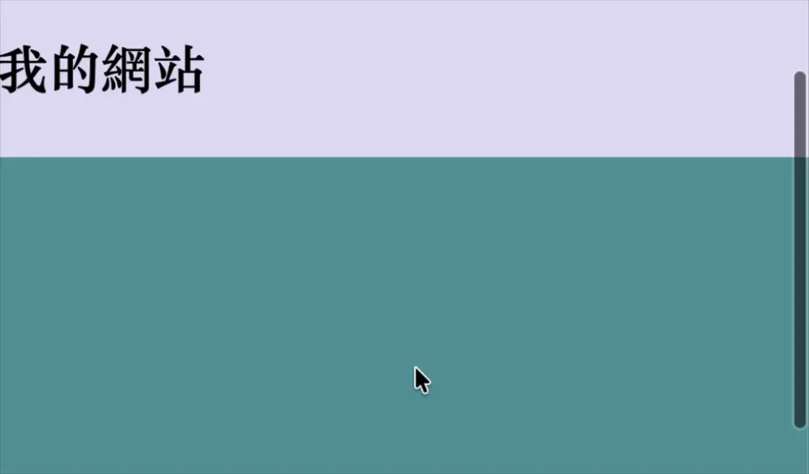
</div>

---

<div class="eyebrow">Sticky</div>

## sticky：只在自己的 section 裡黏住

<div class="grid grid-cols-[1fr_1.4fr] gap-8 items-center">

```css
section {
	display: flex;
	position: relative;
}

h2 {
	flex-shrink: 0;
	position: sticky;
	top: 0;
}
```

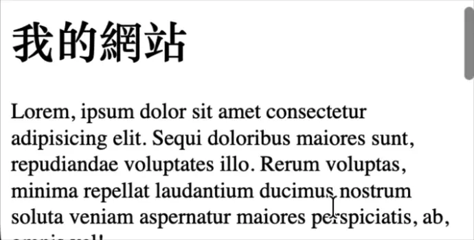
</div>

---

<div class="eyebrow">Example</div>

## 一次分辨所有 position

<div class="grid grid-cols-[1fr_1.1fr] gap-8 items-center">

<div>

<div class="table-clean">

| 東西     | position   | 為什麼                 |
| -------- | ---------- | ---------------------- |
| 太陽     | `fixed`    | 滾動也不會動           |
| 第一朵雲 | `static`   | 設了 `left` 也沒用     |
| 第二朵雲 | `relative` | 從原位偏移             |
| 建築物   | `relative` | 給屋頂當定位點         |
| 屋頂     | `absolute` | 以建築物為準，不佔位置 |

</div>

<p class="dim !mt-3"><a href="https://codepen.io/elvismao/pen/rNoYOKZ">開啟 CodePen 範例</a></p>

</div>
</div>

---
layout: statement
class: say
---

那 Ariana Grande 的 Positions 標題要怎麼定位？


---
layout: section
---

<div class="eyebrow">Chapter 10</div>

# Transform 與動態

---

<div class="eyebrow">Transform</div>

## 原本位置佔著，但可以變形

<div class="grid grid-cols-[1fr_1.2fr] gap-8 items-center">
<div>

```css
transform: rotate(90deg);
transform: translate(往右, 往下);
transform: translateX(往右);
transform: translateY(往下);
```

```css
.translate {
	background-color: pink;
	transform: translate(100px, -50px);
}
```

</div>
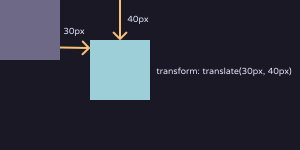
</div>

---

<div class="eyebrow">Centering</div>

## translate 的 % 是以自己為基準

<div class="grid grid-cols-[1fr_1.2fr] gap-8 items-center">
<div>

```css
.outer {
	position: relative;
}

img {
	position: absolute;
	top: 50%;
	left: 50%;
	transform: translate(-50%, -50%);
}
```

<p class="dim !mt-3">把定位點移到元素正中間，水平垂直置中。當然 <code>display: flex</code> 也可以。</p>

</div>
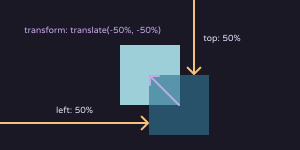
</div>

---

<div class="eyebrow">:hover & :active</div>

## 滑過、按下

<div class="grid grid-cols-2 gap-8 items-center">

```css
a {
	color: blue;
}

a:hover {
	color: red; /* 滑鼠滑過 */
}

a:active {
	color: green; /* 按下去 */
}
```

<div class="preview text-center text-2xl">
<a href="#" class="hover-demo" onclick="return false">把滑鼠移過來、按下去</a>
</div>
</div>

<style>
.hover-demo {
	color: blue !important;
}

.hover-demo:hover {
	color: red !important;
}

.hover-demo:active {
	color: green !important;
}
</style>

---

<div class="eyebrow">transition</div>

## 屬性改變時，平滑地切過去

<div class="grid grid-cols-[1.3fr_1fr] gap-8 items-center">
<div class="code-sm">

```css
transition: 屬性 時間 延遲 速度;

transition: all 0.3s 0s ease;
transition:
	padding 0.3s 0s,
	background-color 1s 1s;
```

```css
button {
	transition: all 0.3s;
}
button:hover {
	transform: scale(1.2);
	background: hotpink;
}
```

</div>
<div class="flex justify-center">
<button class="transition-demo">滑過我</button>
</div>
</div>

<style>
.transition-demo {
	padding: 0.8rem 1.6rem;
	border-radius: 12px;
	background: var(--purple);
	color: var(--ink);
	font-size: 1.3rem;
	transition: all 0.3s;
}

.transition-demo:hover {
	transform: scale(1.2);
	background: hotpink;
}
</style>

---

<div class="eyebrow">overflow</div>

## 東西超出容器怎麼辦？

<div class="grid grid-cols-[1.2fr_1fr] gap-8 items-center">

```css
overflow: visible; /* 突出去，預設 */
overflow: hidden; /* 切掉 */
overflow: scroll; /* 一定有捲軸 */
overflow: auto; /* 需要才有捲軸 */
overflow: hidden visible; /* 分別設定 x、y */
```

<div style="height: 140px; overflow: auto; border: 1px solid var(--hairline-strong); border-radius: 12px; padding: 0.8rem 1rem" class="dim">
<code>overflow: auto</code> 的盒子。<br />
Lorem ipsum dolor sit amet consectetur adipisicing elit. Sequi doloribus maiores sunt, repudiandae voluptates illo. Rerum voluptas, minima repellat laudantium ducimus nostrum soluta veniam aspernatur maiores perspiciatis, ab, omnis vel!
</div>
</div>

---

<div class="eyebrow">Media Query</div>

## 不同螢幕大小，不同樣式

<div class="grid grid-cols-[1.2fr_1fr] gap-8 items-center">
<div>

```css
@media screen and (條件) and (條件) {
	/* CSS */
}
```

```css
@media (max-width: 600px) {
	h1 {
		font-size: 2rem;
	}
}
```

</div>
<p class="lead">螢幕寬度小於 600px 的時候，大標題改成 <code>2rem</code>。</p>
</div>

---
layout: statement
class: say
---

玩得開心 (:

<p class="sub !mt-6">學習更多：<a href="https://emtech.cc/p/webpallet-3">emtech.cc/p/webpallet-3</a></p>
<p class="sub">Flex：<a href="https://emtech.cc/p/2023ironman-3">emtech.cc/p/2023ironman-3</a></p>

---
src: ../global/cc.md
---
