# Frontend Workshop

三小時，從第一行 HTML 到網站上線 🚀

毛哥EM ・ SDC

<div class="absolute right-20 top-1/2 -mt-28 flex items-end gap-4 logo-row">

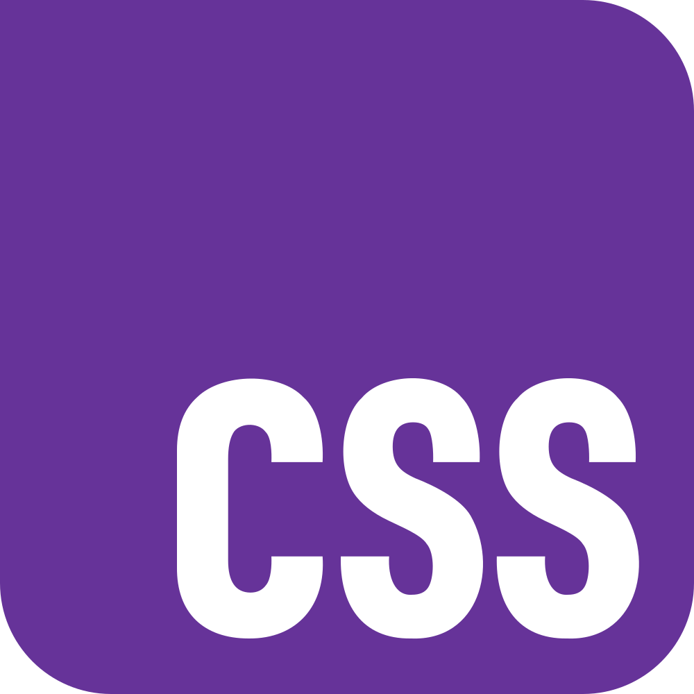

</div>

---
layout: statement
class: say
---

<div class="eyebrow">文章教學</div>

這份簡報可以搭配完整課程一起服用

<div class="qr mt-8">

</div>

<div class="sub mt-4">
<a href="https://emtech.cc/course/frontend/">emtech.cc/course/frontend</a>
</div>

---
src: ../global/me.md
---

---
layout: statement
class: say
---

想知道平常看到的網頁，到底是怎麼做出來的？

<p v-click>想親手完成一個<strong>真的可以分享給別人</strong>的網站？</p>

---

<div class="eyebrow">Today</div>

## 今天三個小時

<div class="grid grid-cols-4 gap-4 mt-6">
<div class="card">
<ph-globe class="card-icon" />
<h3>網頁怎麼運作</h3>
<p class="dim">伺服器<br />HTTP、DNS<br />前端與後端</p>
</div>
<div class="card">
<ph-code class="card-icon" />
<h3>三兄弟</h3>
<p class="dim">HTML 入門<br />CSS 入門<br />JavaScript 入門</p>
</div>
<div class="card">
<ph-plugs-connected class="card-icon" />
<h3>API 串接</h3>
<p class="dim">fetch<br />JSON<br />async / await</p>
</div>
<div class="card">
<ph-rocket-launch class="card-icon" />
<h3>上線</h3>
<p class="dim">Git 與 GitHub<br />GitHub Pages 部署<br />專案實戰</p>
</div>
</div>

<p class="lead !mt-8 text-center">不需要任何前端經驗。下課的時候，你會有一個<strong>自己的網址</strong>。</p>

---

<div class="eyebrow">Schedule</div>

## 時程

<div class="grid grid-cols-[1fr_300px] gap-10 items-center">
<div class="agenda">
<span class="t">00:00</span><span>開場、環境建置</span>
<span class="t">00:15</span><span>網頁是怎麼運作的？</span>
<span class="t">00:35</span><span>HTML 入門</span>
<span class="t">01:00</span><span>CSS 入門</span>
<span class="t break">01:30</span><span class="break">休息 ☕</span>
<span class="t">01:40</span><span>JavaScript 入門</span>
<span class="t">02:00</span><span>API 串接</span>
<span class="t">02:15</span><span>Git、GitHub 與 GitHub Pages 部署</span>
<span class="t">02:30</span><span>專案實戰，讓你的網站上線</span>
</div>
<div class="card">
<h3>今天的節奏</h3>
<p class="dim">語法講得很快，<strong>不用背</strong>。重點是知道有這些東西、知道去哪裡查。</p>
<p class="dim !mt-3">卡住就舉手，助教會過去。</p>
</div>
</div>

---
layout: section
---

<div class="eyebrow">Chapter 00</div>

# 環境建置

<p class="muted">先把工具裝好，等一下才不會手忙腳亂。</p>

---

<div class="eyebrow">Checklist</div>

## 今天需要的東西

<div class="grid grid-cols-2 gap-5 mt-4">
<div v-click class="card">
<ph-code class="card-icon" />
<h3>Visual Studio Code</h3>
<p class="dim">寫程式的地方</p>
</div>
<div v-click class="card">
<ph-broadcast class="card-icon" />
<h3>Live Server 擴充功能</h3>
<p class="dim">存檔就自動重新整理網頁</p>
</div>
<div v-click class="card">
<ph-browser class="card-icon" />
<h3>瀏覽器</h3>
<p class="dim">Chrome、Firefox、Edge、Safari 都可以</p>
</div>
<div v-click class="card">
<ph-github-logo class="card-icon" />
<h3>GitHub 帳號</h3>
<p class="dim">最後部署網站要用</p>
</div>
</div>

<p v-click class="muted !mt-6 text-center">Git 有裝很好，沒裝也沒關係，今天有<strong>網頁版</strong>的做法。</p>

---
layout: statement
class: say
---

<div class="eyebrow">IDE</div>

寫網站至少需要三個 App：編輯器、終端機、瀏覽器

<p v-click>如果有一個<strong>整合式開發環境</strong>把它們包在一起呢？</p>

---

<div class="grid grid-cols-[1fr_1.3fr] gap-10 items-center">
<div>

<div class="eyebrow">Step 1</div>

## 下載 VS Code

<p class="lead"><a href="https://code.visualstudio.com/">code.visualstudio.com</a></p>

<p class="dim">Windows：下一步、下一步、下一步。<br />Mac：拖進「應用程式」，結束。</p>

<p class="muted text-sm !mt-6">有自己習慣的編輯器（Vim、WebStorm）繼續用也沒問題。</p>

</div>
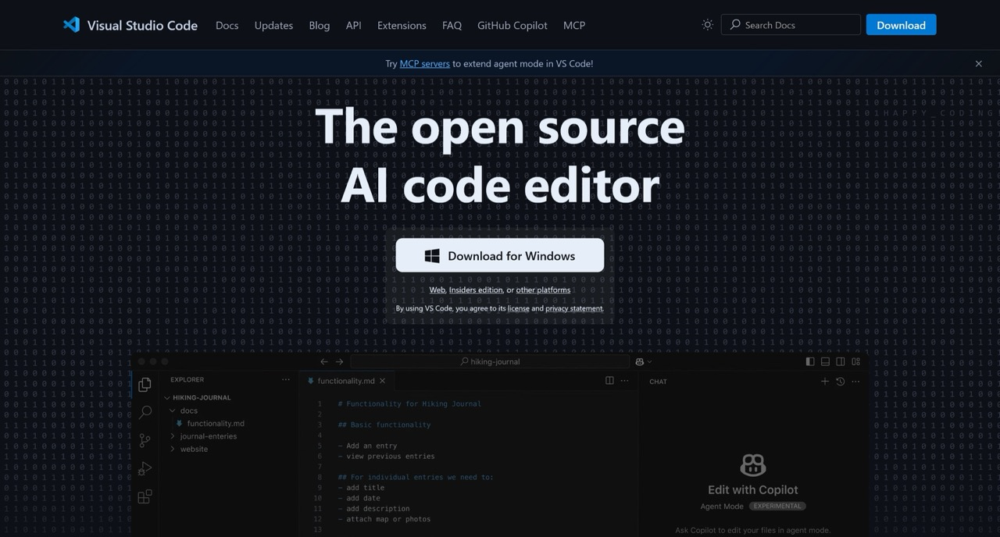
</div>

---

<div class="grid grid-cols-[1fr_1.4fr] gap-10 items-center">
<div>

<div class="eyebrow">Step 2</div>

## 安裝 Live Server

<ol class="lead">
<li><kbd>Ctrl</kbd> + <kbd>Shift</kbd> + <kbd>X</kbd>（Mac：<kbd>Cmd</kbd>）</li>
<li>或點左邊四個正方形</li>
<li>搜尋 <code>live server</code></li>
<li>按 <strong>Install</strong></li>
</ol>

<p class="dim !mt-4">認明作者 Ritwick Dey，紫色的天線圖示。</p>

</div>
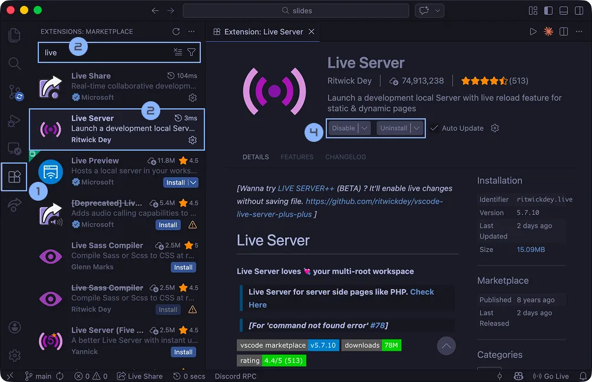
</div>

---

<div class="grid grid-cols-[1fr_1.4fr] gap-10 items-center">
<div>

<div class="eyebrow">Step 3</div>

## 開一個資料夾

<p class="lead">在桌面建一個資料夾，例如 <code>my-website</code>。</p>

<p class="dim">VS Code：<strong>File → Open Folder</strong>，選剛剛的資料夾。</p>

<p class="muted text-sm !mt-6">之後今天所有的檔案都放在這裡面。</p>

</div>

</div>

---

<div class="grid grid-cols-[1fr_1.4fr] gap-10 items-center">
<div>

<div class="eyebrow">Step 4</div>

## 建第一個檔案、Go Live

<ol class="lead">
<li v-click>新增檔案 <code>index.html</code></li>
<li v-click>輸入 <code>!</code> 再按 <kbd>Tab</kbd></li>
<li v-click>在 <code>&lt;body&gt;</code> 裡打點東西</li>
<li v-click>按右下角 <strong>Go Live</strong></li>
</ol>

</div>
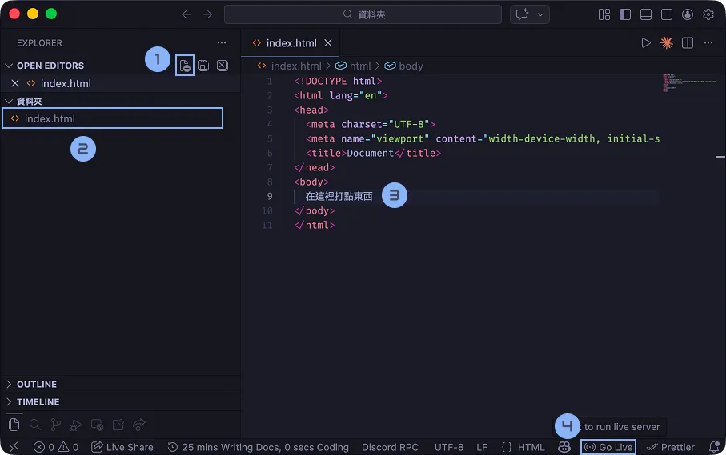
</div>

---

<div class="grid grid-cols-[1fr_1.4fr] gap-10 items-center">
<div>

<div class="eyebrow">It's alive</div>

## 網站活起來了！

<p class="lead">瀏覽器會自己打開 <code>127.0.0.1:5500</code>。</p>

<p class="dim">之後每次 <kbd>Ctrl</kbd> / <kbd>Cmd</kbd> + <kbd>S</kbd> 存檔，畫面就會自動更新。</p>

<p v-click class="dim !mt-6">建議 VS Code 放左邊、瀏覽器放右邊，邊寫邊看。</p>

</div>

</div>

---

<div class="eyebrow">Step 5</div>

## 註冊 GitHub 帳號

<Steps class="mt-6" :cols="5" mode="auto" :items="[{ t: '打開 github.com', d: '右上角 Sign up' }, { t: '輸入 Email', d: '學校信箱之後可以申請學生方案' }, { t: '設定密碼', d: '' }, { t: '取一個 Username', d: '會變成你的網址！' }, { t: '收信驗證', d: '輸入信裡的驗證碼' }]" />

<div class="grid grid-cols-2 gap-6 mt-8">
<div class="card">
<h3>Username 想清楚一點</h3>
<p class="dim">等一下你的網站網址就是：</p>
<p class="mono !mt-2"><span class="good">username</span>.github.io</p>
</div>
<div class="card">
<h3>已經有帳號？</h3>
<p class="dim">登入確認一下還記得密碼就好。<br />有開兩步驟驗證的，手機記得帶。</p>
</div>
</div>

---
layout: section
---

<div class="eyebrow">Chapter 01</div>

# 網頁是怎麼運作的？

---
layout: statement
class: say
---

你看過 Word 檔吧？

<div class="flex justify-center items-center gap-16 mt-10">
<div v-click class="text-center">

<p class="sub !mt-3"><code>.docx</code> 用 <strong>Word</strong> 打開</p>
</div>
<div v-click class="text-center">

<p class="sub !mt-3"><code>.html</code> 用 <strong>瀏覽器</strong> 打開</p>
</div>
</div>

<p v-click class="!mt-10">網頁，就是一個用瀏覽器打開的文件。</p>

---

<div class="grid grid-cols-[1fr_1.3fr] gap-10 items-center">
<div>

<div class="eyebrow">Experiment</div>

## 來做個實驗

<ol class="lead">
<li>建一個文字檔，隨便打點東西</li>
<li>副檔名改成 <code>a.html</code></li>
<li>雙擊打開</li>
</ol>

<p v-click class="say !mt-6"><span class="big">一個網頁就做好了。</span></p>

</div>
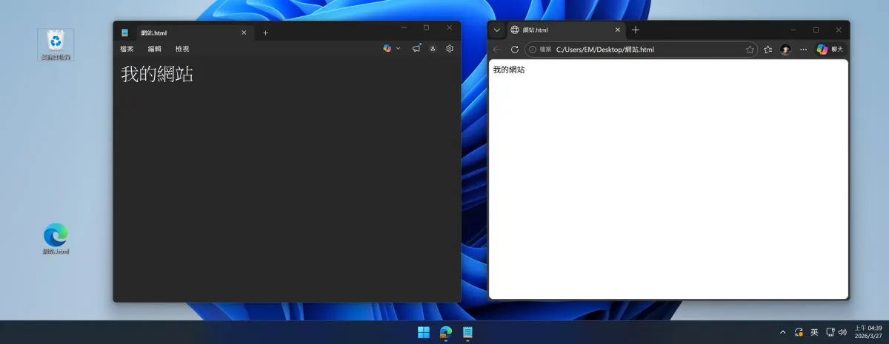
</div>

---

<div class="eyebrow">Files</div>

## 跟 Word 不一樣的地方

<div class="grid grid-cols-2 gap-8 mt-4">
<div class="card text-center">

<h3>Word：全部包成一個檔案</h3>
<p class="dim">文字、圖片、格式都塞進 <code>.docx</code></p>
</div>
<div class="card text-center">
<div class="flex justify-center gap-3 mb-3">


</div>
<h3>網站：每個東西分開放</h3>
<p class="dim">放在同一個資料夾裡，方便各自編輯</p>
</div>
</div>

---
clicks: 2
---

<div class="eyebrow">HTML / CSS / JavaScript</div>

## 一個網頁通常由三個東西組成

<WebLayers class="mt-6" :step="$clicks" />

---

<div class="eyebrow">Analogy</div>

## 換個比喻

<div class="table-clean mt-4">

|                | 人          | 房子    | 拿掉會怎樣                     |
| -------------- | ----------- | ------- | ------------------------------ |
| **HTML**       | 💀 骨架     | 🏗️ 結構 | 整個空白                       |
| **CSS**        | 👕 皮膚衣服 | 🎨 裝潢 | 很單調、很難讀                 |
| **JavaScript** | 🧠 大腦     | 💡 電器 | 按鈕沒反應，例如複製按鈕不能用 |

</div>

---

<div class="eyebrow">No CSS</div>

## 把 emtech.cc 的 CSS 拿掉

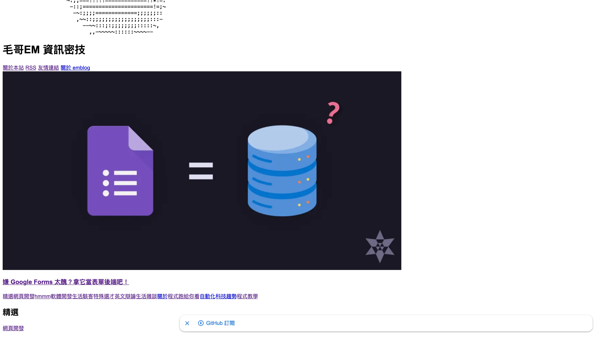

<p class="dim text-center !mt-4">內容都還在，但你不會想讀它。</p>

---
layout: statement
class: say
---

但這個資料夾只在<strong>你的電腦</strong>裡

<p v-click>別人要怎麼拿到？</p>

<p v-click class="muted">需要一個人一直站在那裡，有人來要檔案就遞給他。</p>

---
layout: statement
class: say
---

這個人叫做<strong>伺服器</strong>

<div v-click class="mt-8">
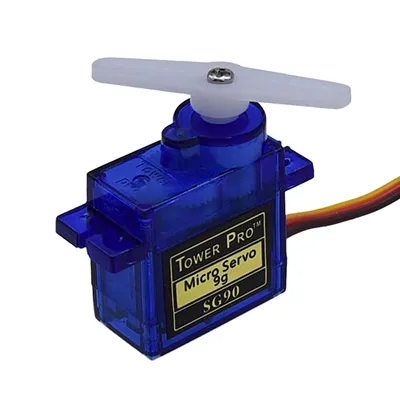
<p class="sub !mt-3">呃，不是這個東西。圖片來源：<a href="https://www.icshop.com.tw/products/368040600064">IC Shop</a></p>
</div>

---
clicks: 3
---

<div class="eyebrow">Request & Response</div>

## 伺服器其實就是一台電腦

<RequestFlow class="mt-2" :step="$clicks" />

<div class="swap mt-2 text-center">
<p class="swap-item lead" :class="{ 'is-on': $clicks === 0 }">平常也能拿來看 YouTube、玩 Minecraft。</p>
<p class="swap-item lead" :class="{ 'is-on': $clicks === 1 }">使用者提出<strong>請求</strong>（Request）</p>
<p class="swap-item lead" :class="{ 'is-on': $clicks === 2 }">伺服器給予<strong>回應</strong>（Response）</p>
<p class="swap-item lead" :class="{ 'is-on': $clicks >= 3 }">還會附上一個<strong>狀態碼</strong>。只要你找它，它都會回你（不像你的前男友）。</p>
</div>

---

<div class="grid grid-cols-[1fr_1.2fr] gap-10 items-center">
<div>

<div class="eyebrow">Status Code</div>

## 狀態碼

<div class="table-clean">

| 狀態碼 | 意思             |
| ------ | ---------------- |
| `200`  | OK 成功          |
| `404`  | Not Found 找不到 |
| `403`  | Forbidden 不准你 |
| `500`  | 伺服器自己炸了   |

</div>

<p class="dim !mt-4">4 開頭的基本上你都不會想看到。</p>
<p class="dim">去 <a href="https://http.cat/">http.cat</a> 或 <a href="https://http.dog/">http.dog</a> 看看。</p>

</div>
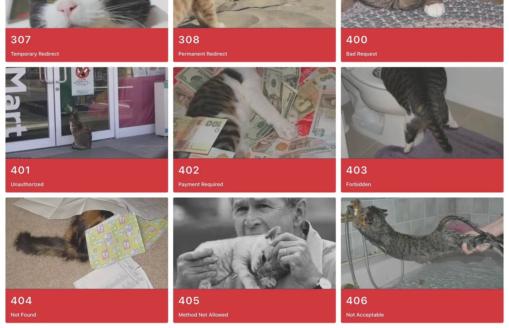
</div>

---
layout: section
---


<div class="eyebrow">寄包裹</div>

# 網站是怎麼傳遞資料的？

<p class="muted">我喜歡把網路比喻成寄包裹。出發前，有幾件事要決定。</p>

---
clicks: 2
---

<div class="eyebrow">HTTP Method · GET</div>

## 交通工具：腳踏車

<Ride vehicle="bike" :step="$clicks" url="google.com/search?q=毛哥EM" :cargo="['q=毛哥EM']" :response="['index.html']" status="200 OK" />

<div class="swap text-center -mt-4">
<p class="swap-item lead" :class="{ 'is-on': $clicks === 0 }">輸入網址載入網站時用的是 <strong>GET</strong>。很簡單，資料直接放在<strong>網址</strong>裡。</p>
<p class="swap-item lead" :class="{ 'is-on': $clicks === 1 }"><code>q=毛哥EM</code>：我要找（query）毛哥EM。</p>
<p class="swap-item lead" :class="{ 'is-on': $clicks >= 2 }">回傳的 HTML 不一定本來就存在，也可能是<strong>剛剛才產生</strong>的。</p>
</div>

---
clicks: 3
---

<div class="eyebrow">HTTP Method · GET</div>

## 物理上，我可以疊無限高

<Ride vehicle="bike" :step="0" url="google.com/search?q=毛哥EM&hl=zh-TW&page=2&safe=off&tbm=isch&…" :cargo="[['q=毛哥EM', 'hl=zh-TW'], ['q=毛哥EM', 'hl=zh-TW', 'page=2', 'safe=off'], ['q=毛哥EM', 'hl=zh-TW', 'page=2', 'safe=off', 'tbm=isch', 'start=10'], ['q=毛哥EM', 'hl=zh-TW', 'page=2', 'safe=off', 'tbm=isch', 'start=10', 'num=50']][$clicks]" />

<p class="dim text-center -mt-4">但瀏覽器和伺服器都會限制網址長度：Chrome 撐得住 2MB，Nginx 預設只收 8KB ~ 16KB。</p>

---
clicks: 3
---

<div class="eyebrow">HTTP Method · POST</div>

## 交通工具：貨車

<Ride vehicle="truck" :step="$clicks" url="example.com/login" :cargo="['account=em', 'password=***']" :response="['歡迎回來']" status="200 OK" />

<div class="swap text-center -mt-4">
<p class="swap-item lead" :class="{ 'is-on': $clicks === 0 }">比較大、比較私密的資料，我們用 <strong>POST</strong>。</p>
<p class="swap-item lead" :class="{ 'is-on': $clicks === 1 }">東西放進後面的貨櫃，也就是 <strong>Body</strong>。</p>
<p class="swap-item lead" :class="{ 'is-on': $clicks === 2 }">經過的人除非把箱子撬開，不然不知道裡面裝什麼。網址上也看不到。</p>
<p class="swap-item lead" :class="{ 'is-on': $clicks >= 3 }">搜尋紀錄、密碼，就不會這樣露餡了。</p>
</div>

---

<div class="eyebrow">Semantics</div>

## 其實最主要的是語意

<div class="table-clean mt-4">

| Method   | 意思               |
| -------- | ------------------ |
| `GET`    | 我要拿東西         |
| `POST`   | 我要建立、給你東西 |
| `PUT`    | 整筆資料換掉       |
| `PATCH`  | 改一部分           |
| `DELETE` | 刪掉               |

</div>

<p v-click class="dim !mt-6 text-center">技術上你也可以每天開殯儀車上學，但使用者、瀏覽器、還有遇到 bug 的你都會很問號。</p>

---
layout: statement
class: say
---

<div class="eyebrow">Protocol</div>

接著選一條路，每條路有自己的交通規則

<div class="flex justify-center gap-3 mt-8">
<span class="pill">HTTP</span>
<span class="pill">FTP</span>
<span class="pill">SSH</span>
<span class="pill good">HTTPS</span>
</div>

<p v-click class="sub !mt-8">HTTPS 是加密過的 HTTP，確保路上沒人能撬開你的貨櫃。就是你網址最前面那個。</p>

---
layout: statement
class: say
---

<div class="eyebrow">IP</div>

要送到哪裡？

<p v-click>網路上的地址叫做 <strong>IP 位址</strong>，例如 <code>140.113.42.195</code></p>

<p v-click class="muted">但這一大串數字太難記了。</p>

<p v-click class="sub !mt-6">就像「臺北市信義區信義路五段 7 號」很難記，「台北 101」就好記多了。</p>

---
clicks: 3
---

<div class="eyebrow">Domain & DNS</div>

## 網域與 DNS：網路的電話簿

<DnsLookup :step="$clicks" />

<div class="swap text-center -mt-2">
<p class="swap-item lead" :class="{ 'is-on': $clicks === 0 }">你在網址列輸入一個好記的<strong>網域</strong>。</p>
<p class="swap-item lead" :class="{ 'is-on': $clicks === 1 }">出發前，瀏覽器先去 <strong>DNS</strong> 查這個網域的地址。</p>
<p class="swap-item lead" :class="{ 'is-on': $clicks === 2 }">DNS 回答真正的 IP。中華電信、Google 都有自己的 DNS。</p>
<p class="swap-item lead" :class="{ 'is-on': $clicks >= 3 }">照著 IP，包裹終於送到伺服器了。</p>
</div>

---

<div class="eyebrow">Domain</div>

## 網域是可以買的

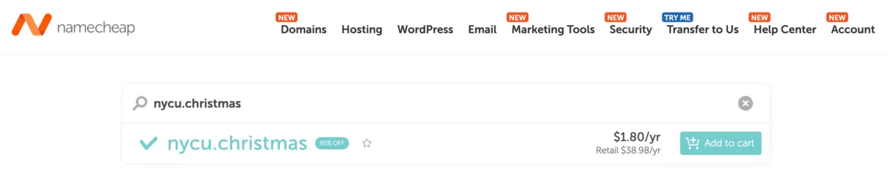

<p class="lead text-center !mt-8">你現在就可以去買個 <code>nycu.christmas</code>！</p>

<p class="dim text-center">最後面的 <code>.com</code>、<code>.net</code> 叫頂級域名，沒什麼意義，你爽就好。</p>

---

<div class="eyebrow">Frontend & Backend</div>

## 所以做一個網站需要兩種人

<div class="grid grid-cols-2 gap-6 mt-4">
<div class="card">

<h3>前端工程師</h3>
<p class="dim">寫你<strong>看得到</strong>的部分：HTML、CSS、JavaScript，在瀏覽器裡跑。</p>
</div>
<div class="card">

<h3>後端工程師</h3>
<p class="dim">寫你<strong>看不到</strong>的部分：伺服器邏輯、資料庫、登入驗證。</p>
</div>
</div>

<p v-click class="lead !mt-8 text-center">今天從前端開始。後端？很多平台已經幫你架好了，<strong>上傳檔案就上線</strong>。</p>

---
layout: section
---

<div class="eyebrow">Chapter 02</div>

# HTML 入門


---
layout: statement
class: say
---

<div class="eyebrow">HyperText Markup Language</div>

HTML 是在<strong>標記</strong>文字

<p v-click>讓瀏覽器和使用者知道「這是什麼」。</p>

<p v-click class="sub !mt-6">Google 會找 <code>&lt;h1&gt;</code> 當標題；語音閱讀器看到 <code>&lt;strong&gt;</code> 會加重語氣。好不好看是 CSS 的事。</p>

---

<div class="eyebrow">Element</div>

## 元素長這樣

<div class="text-center mt-10">
<div class="text-3xl font-bold mono">
<span class="good">&lt;a</span> <span style="color: var(--orange)">href</span>=<span style="color: var(--yellow)">"https://emtech.cc"</span><span class="good">&gt;</span>毛哥EM<span class="good">&lt;/a&gt;</span>
</div>
</div>

<div class="grid grid-cols-4 gap-4 mt-10">
<div v-click class="card text-center"><div class="good mono">&lt;a&gt;</div><p class="dim">開始標籤</p></div>
<div v-click class="card text-center"><div class="mono" style="color: var(--orange)">href="…"</div><p class="dim">屬性 = 屬性值</p></div>
<div v-click class="card text-center"><div class="mono">毛哥EM</div><p class="dim">內容</p></div>
<div v-click class="card text-center"><div class="good mono">&lt;/a&gt;</div><p class="dim">有 <code>/</code> 就是結束</p></div>
</div>

---

<div class="eyebrow">Cheatsheet</div>

## 最常用的元素，一次看完

<div class="grid grid-cols-[1.25fr_1fr] gap-8 items-center">
<div class="code-sm">

```html
<h1>大標題</h1>
<h2>小一點的標題</h2>
<p>
	一段文字，
	<b>粗體</b>
	、
	<i>斜體</i>
</p>

<ul>
	<li>無序清單</li>
	<li>第二項</li>
</ul>

<a href="https://emtech.cc">超連結</a>

<button>按鈕</button>
<input type="text" placeholder="輸入框" />
```

</div>
<div class="preview">
<h1>大標題</h1>
<h2>小一點的標題</h2>
<p>一段文字，<b>粗體</b>、<i>斜體</i></p>
<ul><li>無序清單</li><li>第二項</li></ul>
<a href="https://emtech.cc">超連結</a><br />
<span style="display: inline-block; padding: 0 0.5em; background: #eee; border-radius: 4px; font-size: 0.85em">🖼️ 一隻貓</span><br />
<button>按鈕</button>
<input type="text" placeholder="輸入框" />
</div>
</div>

---

<div class="grid grid-cols-[1fr_260px] gap-10 items-center">
<div>

<div class="eyebrow">Emmet</div>

## 不要手打角括號

<p class="lead">打縮寫，按 <kbd>Tab</kbd>，VS Code 幫你展開。</p>

<div class="table-clean mt-4">

| 輸入      | 按 Tab 之後                |
| --------- | -------------------------- |
| `!`       | 整份 HTML 模板             |
| `h1`      | `<h1></h1>`                |
| `ul>li*3` | `<ul>` 裡面三個 `<li>`     |
| `.card`   | `<div class="card"></div>` |

</div>
</div>
<div class="card text-center">
<ph-keyboard class="card-icon" />
<p>程式碼亂了？</p>
<p class="dim !mt-2"><kbd>Shift</kbd> + <kbd>Alt</kbd> + <kbd>F</kbd><br />自動排版</p>
</div>
</div>

---

<div class="eyebrow">Path</div>

## 圖片、連結的路徑

<div class="grid grid-cols-[220px_1fr] gap-10 items-center">

```text
my-website
├── index.html
├── style.css
├── script.js
└── img
    └── cat.jpg
```

<div>

<div class="table-clean">

| 寫法                 | 意思             |
| -------------------- | ---------------- |
| `./style.css`        | 同一個資料夾     |
| `./img/cat.jpg`      | 進 img 資料夾    |
| `../logo.png`        | 往外一層         |
| `https://…/logo.png` | 網路上的絕對路徑 |

</div>

<p v-click class="dim !mt-4">今天一律用 <code>./</code> 開頭的<strong>相對路徑</strong>，等一下部署才不會壞。</p>

</div>
</div>

---

<div class="eyebrow">Semantic</div>

## 用有意義的標籤分區塊

<div class="grid grid-cols-[1fr_1.1fr] gap-8 items-center">
<div class="code-sm">

```html
<header>
	<h1>我的網站</h1>
	<nav>
		<a href="#about">關於</a>
		<a href="#works">作品</a>
	</nav>
</header>
<main>
	<section id="about">…</section>
	<section id="works">…</section>
</main>
<footer>© 2026 毛哥EM</footer>
```

</div>
<div>
<p class="lead">外表跟 <code>&lt;div&gt;</code> 一模一樣，沒有任何視覺效果。</p>
<p class="dim">但瀏覽器、搜尋引擎、語音閱讀器都看得懂這區是做什麼的。</p>
<p v-click class="dim !mt-4"><code>href="#about"</code> 可以跳到 <code>id="about"</code> 的位置。</p>
</div>
</div>

---
layout: statement
class: say
---

<div class="eyebrow">Try it</div>

在 <code>index.html</code> 寫一張自我介紹

<p class="sub !mt-6">一個 <code>&lt;h1&gt;</code> 名字、一段 <code>&lt;p&gt;</code> 介紹、一個興趣清單、一個連結。</p>

<p class="sub">更多元素：<a href="https://emtech.cc/course/frontend/html/">環境建置與 HTML 完全指南</a></p>

---
layout: section
---

<div class="eyebrow">Chapter 03</div>

# CSS 入門


---

<div class="eyebrow">Syntax</div>

## 選誰、改什麼、改成什麼

<div class="grid grid-cols-2 gap-10 items-center">
<div>

```css
選擇器 {
	屬性: 屬性值;
}
```

```css
h1 {
	color: blue;
}
```

</div>
<div class="preview">
<h1 style="color: blue">我是標題</h1>
</div>
</div>

<p class="dim !mt-6">滑鼠移到顏色上，VS Code 還會給你調色盤。</p>

---

<div class="eyebrow">Where</div>

## CSS 寫在哪？

<div class="grid grid-cols-2 gap-6 mt-2">
<div class="card">
<h3>獨立一個 <code>style.css</code></h3>

```html
<head>
	<link rel="stylesheet" href="./style.css" />
</head>
```

<p class="dim">今天用這個。</p>
</div>
<div class="card">
<h3>或寫在 <code>&lt;style&gt;</code> 裡</h3>

```html
<style>
	h1 {
		color: blue;
	}
</style>
```

<p class="dim">小東西快速試試看可以。</p>
</div>
</div>

---

<div class="eyebrow">Selector</div>

## 三個最常用的選擇器

<div class="grid grid-cols-3 gap-5 mt-4">
<div class="card">
<div class="eyebrow">元素</div>

```css
p {
	color: gray;
}
```

<p class="dim">所有 <code>&lt;p&gt;</code></p>
</div>
<div class="card" style="border-color: var(--purple)">
<div class="eyebrow">class（最常用）</div>

```css
.card {
	padding: 16px;
}
```

<p class="dim"><code>class="card"</code>，可以重複用</p>
</div>
<div class="card">
<div class="eyebrow">id</div>

```css
#title {
	color: red;
}
```

<p class="dim"><code>id="title"</code>，一頁只有一個</p>
</div>
</div>

<p class="muted !mt-6 text-center">兩條規則打架時：id 贏過 class 贏過元素；一樣強，後寫的贏。</p>

---

<div class="eyebrow">Text & Color</div>

## 文字與顏色

<div class="grid grid-cols-[1.3fr_1fr] gap-8 items-center">

```css
h1 {
	color: #6b21a8; /* HEX，設計圖直接複製 */
	background-color: #f3e8ff;
	font-size: 32px;
	font-weight: 700; /* 400 正常、700 粗 */
	text-align: center;
	font-family: system-ui, sans-serif;
	line-height: 1.5;
}
```

<div class="preview">
<h1 style="color: #6b21a8; background-color: #f3e8ff; font-size: 32px; font-weight: 700; text-align: center; font-family: system-ui, sans-serif; line-height: 1.5">Hello CSS</h1>
</div>
</div>

<p class="muted !mt-4">顏色可以寫 <code>red</code>、<code>#ff0000</code>、<code>rgb(255, 0, 0)</code>、<code>hsl(0, 100%, 50%)</code>，都一樣。</p>

---
clicks: 3
---

<div class="eyebrow">Box Model</div>

## 每個元素都是一個盒子

<div class="grid grid-cols-[1.1fr_1fr] gap-10 items-center">

```css {all|2|3|4}
.card {
	padding: 24px; /* 內距：盒子裡面留白 */
	border: 4px solid #ec4899; /* 邊框 */
	margin: 32px; /* 外距：跟別人保持距離 */
}
```

<div class="flex justify-center">
<div class="transition-all duration-500" :style="{ background: $clicks >= 3 ? 'rgb(255 184 108 / 0.25)' : 'transparent', padding: $clicks >= 3 ? '32px' : '0', borderRadius: '6px' }">
<div class="transition-all duration-500" :style="{ background: 'rgb(80 250 123 / 0.25)', padding: $clicks >= 1 ? '24px' : '0', border: $clicks >= 2 ? '4px solid #ec4899' : '0px solid transparent' }">
<div style="background: #8be9fd; color: #222; padding: 8px 16px; font-weight: 700">內容</div>
</div>
</div>
</div>
</div>

<div class="flex justify-center gap-6 mt-6 text-sm">
<span><span style="color: #50fa7b">■</span> padding</span>
<span><span style="color: #ec4899">■</span> border</span>
<span><span style="color: #ffb86c">■</span> margin</span>
</div>

<p class="muted text-center !mt-2">先寫 <code>* { box-sizing: border-box; }</code>，寬高就會把 padding 和 border 算進去，比較直覺。</p>

---

<div class="eyebrow">Flexbox</div>

## 排版就用 Flexbox

<div class="grid grid-cols-[1fr_1.3fr] gap-8 items-center">
<div>

```css
.container {
	display: flex;
	justify-content: center; /* 主軸 */
	align-items: center; /* 交叉軸 */
	gap: 16px; /* 中間留白 */
}
```

<p class="dim !mt-4">在<strong>外面的容器</strong>設定，裡面的東西就會乖乖並排。</p>
<p class="dim">還不熟就去玩 <a href="https://flexboxfroggy.com/#zh-tw">Flexbox Froggy</a>。</p>

</div>
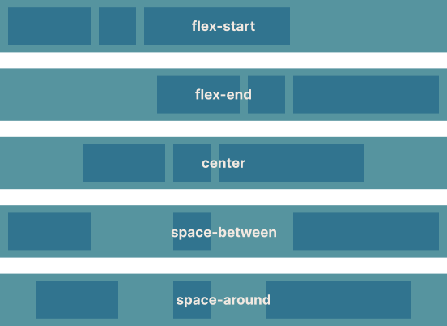
</div>

---

<div class="eyebrow">Flexbox</div>

## 一行置中，以前要寫一整頁

<div class="grid grid-cols-2 gap-8 items-center">

```css
body {
	min-height: 100vh;
	display: flex;
	justify-content: center;
	align-items: center;
}
```

<div class="preview" style="height: 220px; display: flex; justify-content: center; align-items: center; background: linear-gradient(135deg, #f6d5f7, #fbe9d7)">
<div style="background: #fff; padding: 16px 28px; border-radius: 16px; box-shadow: 0 12px 30px -12px rgb(80 30 90 / 0.4)">我在正中間</div>
</div>
</div>

---

<div class="eyebrow">Interaction</div>

## 滑過去的效果

<div class="grid grid-cols-[1.2fr_1fr] gap-8 items-center">

```css
button {
	border-radius: 999px;
	background: #e9d5ff;
	transition: all 0.3s; /* 變化花 0.3 秒 */
}

button:hover {
	background: #ec4899;
	transform: scale(1.1);
}
```

<div class="flex justify-center">
<button class="fw-hover">把滑鼠移過來</button>
</div>
</div>

<style>
.fw-hover {
	padding: 0.7rem 1.6rem;
	border-radius: 999px;
	background: #e9d5ff;
	color: #6b21a8;
	font-size: 1.2rem;
	font-weight: 700;
	transition: all 0.3s;
}

.fw-hover:hover {
	background: #ec4899;
	color: #fff;
	transform: scale(1.1);
}
</style>

---
layout: statement
class: say
---

<div class="eyebrow">Try it</div>

建一個 <code>style.css</code>，把自我介紹變成一張卡片

<p class="sub !mt-6">置中、加背景色、圓角 <code>border-radius</code>、陰影 <code>box-shadow</code>。</p>

<p class="sub">更多語法：<a href="https://emtech.cc/course/frontend/css/">CSS 教學：從入門到精通</a></p>

---
layout: statement
class: say
---

# ☕

休息十分鐘

---
layout: section
---

<div class="eyebrow">Chapter 04</div>

# JavaScript 入門


---

<div class="eyebrow">Script</div>

## 把 JavaScript 放進網頁

<div class="grid grid-cols-2 gap-8 items-center">
<div>

```html
<!-- index.html，放在 </body> 前面 -->
<script src="./script.js"></script>
```

```js
// script.js
console.log("哈囉");
```

</div>
<div>
<p class="lead"><code>console.log()</code> 是 JavaScript 的 Hello World。</p>
<p class="dim">按 <kbd>F12</kbd> 打開開發者工具，切到 <strong>Console</strong> 就看得到。</p>
<p v-click class="dim !mt-4">程式不知道跑到哪、變數裡裝了什麼？先 <code>console.log()</code> 再說。網頁出錯也會在這裡變紅色。</p>
</div>
</div>

---

<div class="eyebrow">DevTools</div>

## 你的第一行 JavaScript

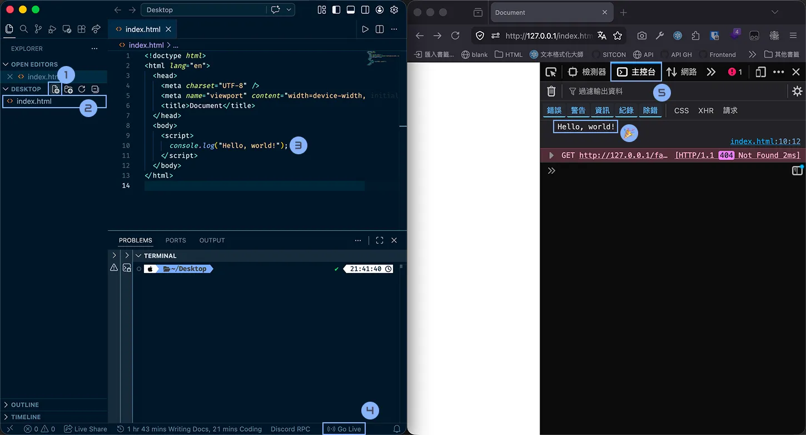

---

<div class="eyebrow">Basics</div>

## 三分鐘語法速成

<div class="grid grid-cols-3 gap-5 mt-2 code-sm">
<div class="card">
<h3>變數：有名字的盒子</h3>

```js
let score = 60;
score = 80; // 可以改

const name = "毛哥EM";
// const 不能重新賦值
```

</div>
<div class="card">
<h3>條件判斷</h3>

```js
if (score >= 60) {
	console.log("及格");
} else {
	console.log("被當");
}
```

</div>
<div class="card">
<h3>函式：打包好的動作</h3>

```js
function hello(who) {
	return `哈囉，${who}！`;
}

hello("SDC"); // "哈囉，SDC！"
```

</div>
</div>

<p class="muted !mt-4 text-center">比較記得用 <code>===</code>，一個 <code>=</code> 是「放進去」。</p>

---

<div class="eyebrow">DOM</div>

## 用 JavaScript 抓網頁上的東西

<div class="grid grid-cols-2 gap-8 items-center">
<div>

```html
<h1 id="title">原本的標題</h1>
```

```js
const title = document.querySelector("#title");

title.textContent = "被 JavaScript 改掉了";
title.style.color = "red";
title.classList.add("active");
```

</div>
<div>
<p class="lead"><code>querySelector</code> 的寫法跟 CSS 選擇器一樣：<code>#id</code>、<code>.class</code>、<code>h1</code>。</p>
<p class="dim">瀏覽器把 HTML 變成一棵 JavaScript 可以操作的樹，叫做 <strong>DOM</strong>。</p>
</div>
</div>

---

<div class="eyebrow">Event</div>

## 按下去，然後呢？

<div class="grid grid-cols-[1.3fr_1fr] gap-8 items-center">
<div>

```html
<button id="btn">♥ 讚</button>
<span id="count">0</span>
```

```js
const btn = document.querySelector("#btn");
const count = document.querySelector("#count");
let likes = 0;

btn.addEventListener("click", () => {
	likes = likes + 1;
	count.textContent = likes;
});
```

</div>
<div class="preview text-center text-2xl">
<button class="fw-like" onclick="this.nextElementSibling.textContent = +this.nextElementSibling.textContent + 1">♥ 讚</button>
<span>0</span>
</div>
</div>

<p class="muted !mt-4">事件還有 <code>input</code>、<code>submit</code>、<code>keydown</code>……「發生某件事的時候，做某件事」。</p>

<style>
.fw-like {
	padding: 0.3rem 1.2rem !important;
	border-radius: 999px !important;
	background: #ec4899 !important;
	color: #fff !important;
	border: none !important;
}

.fw-like:active {
	transform: scale(0.94);
}
</style>

---
layout: section
---

<div class="eyebrow">Chapter 05</div>

# API 串接

<p class="muted">別人的伺服器，你的資料。</p>

---
layout: statement
class: say
---

<div class="eyebrow">API</div>

伺服器不只會回傳網頁

<p v-click>也可以只回傳<strong>資料</strong>，讓你的 JavaScript 拿去用。</p>

<p v-click class="sub !mt-6">天氣、匯率、YouTube 影片、寶可夢圖鑑、狗狗照片……這種「給程式用的窗口」就叫 <strong>API</strong>。</p>

---
clicks: 2
---

<div class="eyebrow">fetch</div>

## 讓 JavaScript 派腳踏車出去

<Ride vehicle="bike" :step="$clicks" from="你的 JavaScript" to="dog.ceo" url="dog.ceo/api/breeds/image/random" :cargo="['random']" :response="['JSON']" status="200 OK" />

<p class="dim text-center -mt-4">還記得 GET 嗎？<code>fetch()</code> 預設就是騎腳踏車去拿東西。</p>

---

<div class="eyebrow">JSON</div>

## 回來的資料長這樣

<div class="grid grid-cols-2 gap-10 items-center">

```json
{
	"message": "https://images.dog.ceo/breeds/shiba/shiba-8.jpg",
	"status": "success"
}
```

<div>
<p class="lead"><strong>JSON</strong>：JavaScript Object Notation</p>
<p class="dim">一堆「名字: 值」，跟 JavaScript 的物件幾乎一模一樣。</p>
<p class="dim !mt-4">拿到之後用 <code>data.message</code> 就能取出圖片網址。</p>
</div>
</div>

---
layout: statement
class: say
---

<div class="eyebrow">Async</div>

但腳踏車騎出去要時間

<p v-click>JavaScript 不會傻傻站在門口等，不然整個網頁會卡住。</p>

<p v-click class="muted">就像二餐丼飯：先拿號碼牌去旁邊坐，好了再叫你。這叫做<strong>非同步</strong>。</p>

---

<div class="eyebrow">async / await</div>

## 用 `await` 等腳踏車回來

<div class="grid grid-cols-[1.4fr_1fr] gap-8 items-center">

```js {all|1|3|4|5|6-8}
async function loadDog() {
	try {
		const response = await fetch("https://dog.ceo/api/breeds/image/random");
		const data = await response.json();
		document.querySelector("#dog").src = data.message;
	} catch (error) {
		console.error("沒拿到", error);
	}
}
```

<div class="swap">
<p class="swap-item lead" :class="{ 'is-on': $clicks === 0 }">有高中英文就看得懂它在幹嘛。</p>
<p class="swap-item lead" :class="{ 'is-on': $clicks === 1 }">裡面有 <code>await</code> 的函式，前面要加 <code>async</code>。</p>
<p class="swap-item lead" :class="{ 'is-on': $clicks === 2 }">派腳踏車出去，<strong>等</strong>它回來。</p>
<p class="swap-item lead" :class="{ 'is-on': $clicks === 3 }">把回來的 JSON 拆開。</p>
<p class="swap-item lead" :class="{ 'is-on': $clicks === 4 }">把圖片網址塞進 <code>&lt;img&gt;</code>。</p>
<p class="swap-item lead" :class="{ 'is-on': $clicks >= 5 }">網路斷了、伺服器炸了，就跑到 <code>catch</code>。</p>
</div>
</div>

---

<div class="eyebrow">Live Demo</div>

## 真的打一次

<DogFetch class="mt-4" />

---

<div class="eyebrow">More APIs</div>

## 其他好玩的免費 API

<div class="table-clean mt-4">

| API         | 網址                                        | 拿到什麼         |
| ----------- | ------------------------------------------- | ---------------- |
| Dog API     | `dog.ceo/api/breeds/image/random`           | 隨機狗狗照片     |
| The Cat API | `api.thecatapi.com/v1/images/search`        | 隨機貓貓照片     |
| PokéAPI     | `pokeapi.co/api/v2/pokemon/pikachu`         | 寶可夢資料       |
| GitHub API  | `api.github.com/users/你的帳號`             | 你的 GitHub 資料 |
| Open-Meteo  | `api.open-meteo.com/v1/forecast?latitude=…` | 天氣預報         |

</div>

<p class="muted !mt-4">注意每個 API 回來的 JSON 長得不一樣，先 <code>console.log(data)</code> 看一下再取值。</p>

---
layout: section
---

<div class="eyebrow">Chapter 06</div>

# Git、GitHub 與部署

---
layout: statement
class: say
---

網站寫好了

<p v-click>但它還是只在<strong>你的電腦</strong>裡。</p>

<p v-click class="muted">還記得嗎？我們需要一台一直開著的伺服器。</p>

---

<div class="eyebrow">GitHub Pages</div>

## 免費的伺服器：GitHub Pages

<div class="grid grid-cols-3 gap-5 mt-4">
<div v-click class="card">
<ph-currency-circle-dollar class="card-icon" />
<h3>免費</h3>
<p class="dim">公開的 Repository 不用錢</p>
</div>
<div v-click class="card">
<ph-lock-key class="card-icon" />
<h3>自帶 HTTPS</h3>
<p class="dim">不用自己處理憑證</p>
</div>
<div v-click class="card">
<ph-link class="card-icon" />
<h3>送你網址</h3>
<p class="dim mono">username.github.io</p>
</div>
</div>

<p v-click class="lead !mt-8 text-center">只能放<strong>靜態網站</strong>：HTML、CSS、JS、圖片。今天做的剛好全部都是。</p>

---

<div class="eyebrow">Recap</div>

## Git 與 GitHub，三十秒複習

<div class="grid grid-cols-2 gap-6 mt-2">
<div class="card">
<ph-git-branch class="card-icon" />
<h3>Git</h3>
<p class="dim">版本控制<strong>軟體</strong>，跑在你的電腦上。幫專案留下一個一個存檔點（Commit）。</p>
</div>
<div class="card">
<ph-github-logo class="card-icon" />
<h3>GitHub</h3>
<p class="dim">放 Git 專案的<strong>線上平台</strong>。一個專案叫一個 Repository。</p>
</div>
</div>

<Steps class="mt-8" mode="auto" :items="['git add', 'git commit', 'git push', 'GitHub Pages 上線']" />

<p class="muted !mt-4 text-center">不熟 Git 沒關係，等一下有<strong>只用網頁</strong>的做法。想學完整的：<a href="https://emtech.cc/course/frontend/git/">Git 與 GitHub 教學</a></p>

---
clicks: 3
---

<div class="eyebrow">Deploy</div>

## 把整個資料夾寄給 GitHub

<Ride vehicle="truck" :step="$clicks" method="PUSH" url="github.com/你的帳號/你的帳號.github.io" from="你的電腦" to="GitHub" to-icon="github" :cargo="['index.html', 'style.css', 'script.js']" :response="['你的網址']" status="上線了 🎉" />

---

<div class="eyebrow">Step 1</div>

## 建一個 Repository

<div class="grid grid-cols-[1fr_1.2fr] gap-10 items-center">
<div>

<ol class="lead">
<li>GitHub 右上角 <strong>+</strong> → <strong>New repository</strong></li>
<li>Repository name 取作：<br /><code class="good">你的帳號.github.io</code></li>
<li>選 <strong>Public</strong></li>
<li>按 <span class="gh-btn">Create repository</span></li>
</ol>

<p v-click class="dim !mt-4">取這個名字，網址就是 <code>你的帳號.github.io</code>；取別的名字也可以，網址會變成 <code>你的帳號.github.io/名字</code>。</p>

</div>
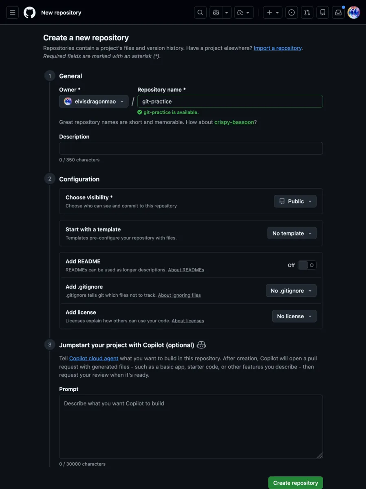
</div>

---

<div class="eyebrow">Step 2 · 方法 A</div>

## 不會 Git？直接用網頁上傳

<div class="grid grid-cols-[1.2fr_1fr] gap-10 items-center">
<div>

<ol class="lead">
<li v-click>空的 Repository 頁面，點 <strong>uploading an existing file</strong><br /><span class="dim text-base">（或 <span class="gh-btn is-plain">Add file</span> → <strong>Upload files</strong>）</span></li>
<li v-click>把資料夾<strong>裡面的檔案</strong>全部拖進去</li>
<li v-click>按 <span class="gh-btn">Commit changes</span></li>
</ol>

</div>
<div class="card">
<h3>⚠️ 拖的是「裡面的東西」</h3>
<p class="dim"><code>index.html</code> 一定要在 Repository 的<strong>最外層</strong>。</p>
<p class="dim !mt-2">如果拖成 <code>my-website/index.html</code>，網址就會找不到首頁。</p>
<p class="dim !mt-2">之後要改？一樣上傳同名檔案蓋過去，或點檔案右上角的 ✏️ 直接改。</p>
</div>
</div>

---

<div class="eyebrow">Step 2 · 方法 B</div>

## 會 Git？用指令推上去

<div class="grid grid-cols-[1.3fr_1fr] gap-8 items-center">

```bash
cd my-website
git init
git add .
git commit -m "feat: my first website"
git branch -M main
git remote add origin https://github.com/你的帳號/你的帳號.github.io.git
git push -u origin main
```

<div>
<p class="lead">在 VS Code 裡按 <kbd>Ctrl</kbd> + <kbd>`</kbd> 打開終端機。</p>
<p class="dim">之後每次改完，只要：</p>

```bash
git add .
git commit -m "fix: typo"
git push
```

<p class="dim">VS Code 左邊的 Source Control 也可以用點的。</p>
</div>
</div>

---

<div class="eyebrow">Step 3</div>

## 打開 GitHub Pages

<Steps class="mt-6" :cols="4" mode="auto" :items="[{ t: 'Settings', d: 'Repository 上方的齒輪' }, { t: 'Pages', d: '左邊選單' }, { t: 'Deploy from a branch', d: 'Source 選這個' }, { t: 'main / (root) → Save', d: 'Branch 選 main' }]" />

<div class="grid grid-cols-2 gap-6 mt-8">
<div class="card">
<h3>等一到兩分鐘</h3>
<p class="dim">上方 <strong>Actions</strong> 分頁會看到一個黃色的點在跑，變綠色勾勾就好了。</p>
</div>
<div class="card">
<h3>回到 Settings → Pages</h3>
<p class="dim">最上面會寫：<em>Your site is live at</em> <code>https://你的帳號.github.io</code></p>
</div>
</div>

---
layout: statement
class: say
---

<div class="eyebrow">🎉</div>

把網址傳給朋友

<p v-click>恭喜，你有一個<strong>全世界都看得到</strong>的網站了。</p>

---

<div class="eyebrow">Troubleshooting</div>

## 網站壞了？先檢查這些

<div class="grid grid-cols-2 gap-5 mt-2">
<div class="card">
<h3><span class="bad mono">404</span> 找不到頁面</h3>
<p class="dim"><code>index.html</code> 不在最外層？檔名打成 <code>Index.html</code>？Pages 有沒有選 main？</p>
</div>
<div class="card">
<h3>圖片、CSS 不見了</h3>
<p class="dim">路徑用 <code>./</code> 開頭，不要用 <code>/</code> 或 <code>C:\Users\…</code>。</p>
</div>
<div class="card">
<h3>本機好好的，上線就壞</h3>
<p class="dim">GitHub 分大小寫：<code>Cat.JPG</code> ≠ <code>cat.jpg</code>。</p>
</div>
<div class="card">
<h3>改了但沒變</h3>
<p class="dim">等一下 Actions 跑完，再 <kbd>Ctrl</kbd> + <kbd>Shift</kbd> + <kbd>R</kbd> 強制重新整理。</p>
</div>
</div>

---
layout: section
---

<div class="eyebrow">Chapter 07</div>

# 專案實戰

<p class="muted">三十分鐘，做一個屬於你的網站。</p>

---

<div class="eyebrow">Project</div>

## 我的個人名片網站

<div class="grid grid-cols-2 gap-8 mt-2">
<div>

<h3 class="!text-lg">基本要求</h3>
<ul class="check lead">
<li>HTML：名字、自我介紹、興趣清單、連結</li>
<li>CSS：做成一張置中的卡片</li>
<li>JavaScript：按鈕呼叫一個 API</li>
<li>部署到 GitHub Pages</li>
<li>把網址貼到 Discord</li>
</ul>

</div>
<div>

<h3 class="!text-lg">做完了？加分題</h3>
<ul class="dim">
<li>滑過去的動畫 <code>:hover</code> + <code>transition</code></li>
<li>深色模式切換按鈕 <code>classList.toggle()</code></li>
<li>手機版排版 <code>@media (max-width: 600px)</code></li>
<li>換一個 API：寶可夢、天氣、你的 GitHub</li>
<li>買一個自己的網域 👀</li>
</ul>

</div>
</div>

---

<div class="eyebrow">Starter · index.html</div>

## 起手式：HTML

<div class="grid grid-cols-[1.5fr_1fr] gap-8 items-center">
<div class="code-sm">

```html
<!-- 先打 ! + Tab，再在 <head> 裡加上這行 -->
<link rel="stylesheet" href="./style.css" />

<!-- <body> 裡面 -->
<main class="card">
	<h1>你的名字</h1>
	<p>一句話介紹自己。</p>
	<ul>
		<li>興趣一</li>
		<li>興趣二</li>
	</ul>
	<a href="https://github.com/你的帳號">我的 GitHub</a>
	<button id="dog-btn">給我一隻狗</button>
	
</main>
<script src="./script.js"></script>
```

</div>
<div>
<p class="lead">檔案結構：</p>

```text
my-website
├── index.html
├── style.css
└── script.js
```

<p class="dim !mt-4">三個檔案放在同一層，路徑都用 <code>./</code> 開頭。</p>
</div>
</div>

---

<div class="eyebrow">Starter · style.css</div>

## 起手式：CSS

<div class="grid grid-cols-2 gap-6 code-sm">

```css
* {
	box-sizing: border-box;
}

body {
	min-height: 100vh;
	margin: 0;
	display: flex;
	justify-content: center;
	align-items: center;
	background: linear-gradient(135deg, #f6d5f7, #fbe9d7);
	font-family: system-ui, sans-serif;
}
```

```css
.card {
	width: 320px;
	padding: 24px;
	border-radius: 20px;
	background: #fff;
	box-shadow: 0 12px 30px -12px rgb(0 0 0 / 0.3);
	text-align: center;
}

#dog {
	width: 100%;
	border-radius: 12px;
}
```

</div>

---

<div class="eyebrow">Starter · script.js</div>

## 起手式：JavaScript

<div class="grid grid-cols-[1.6fr_1fr] gap-8 items-center code-sm">

```js
const btn = document.querySelector("#dog-btn");
const dog = document.querySelector("#dog");

async function loadDog() {
	try {
		const response = await fetch("https://dog.ceo/api/breeds/image/random");
		const data = await response.json();
		dog.src = data.message;
	} catch (error) {
		console.error("沒拿到狗", error);
	}
}

btn.addEventListener("click", loadDog);
```

<div>
<p class="lead">按按鈕 → 派腳踏車 → 拿到 JSON → 換圖片。</p>
<p class="dim !mt-4">想換別的 API？先 <code>console.log(data)</code> 看資料長怎樣。</p>
</div>
</div>

---
clicks: 4
---

<div class="eyebrow">Workflow</div>

## 接下來三十分鐘

<Steps class="mt-6" :step="$clicks" :items="['複製起手式', '改成你自己的內容', '用 CSS 打扮', '上傳到 GitHub', '開 Pages、貼網址']" />

<p class="lead !mt-10 text-center">卡住就舉手。<strong>Console 紅字</strong>先截圖給助教看。</p>

---
layout: statement
class: say
---

三個小時，從寫下第一行 HTML

<p v-click>到讓自己的網站真正上線。</p>

<p v-click class="sub !mt-8">完整課程：<a href="https://emtech.cc/course/frontend/">emtech.cc/course/frontend</a></p>

---
layout: statement
class: say
---

# Q & A

---
src: ../global/cc.md
---

---
layout: statement
---

<div class="eyebrow">素材來源</div>

<p class="text-lg">插圖：<a href="https://www.flaticon.com/free-icons/law" title="law icons">Law icons created by smashingstocks - Flaticon</a></p>

<p class="muted text-sm !mt-2">部分圖示經裁切、調整後使用</p>

<div class="flex justify-center items-end gap-8 mt-8">
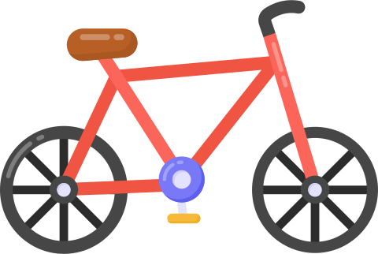


</div>
