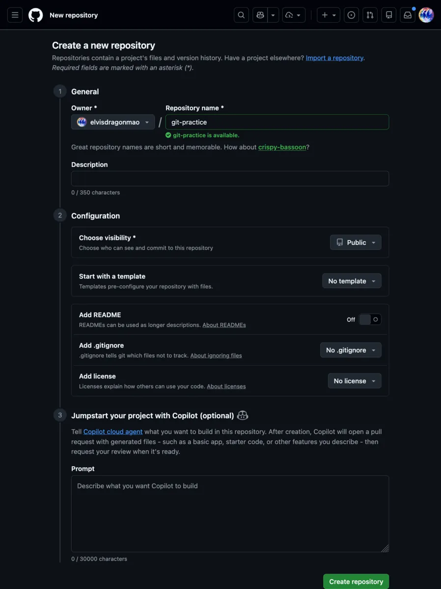
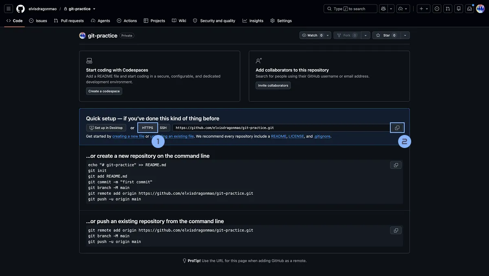
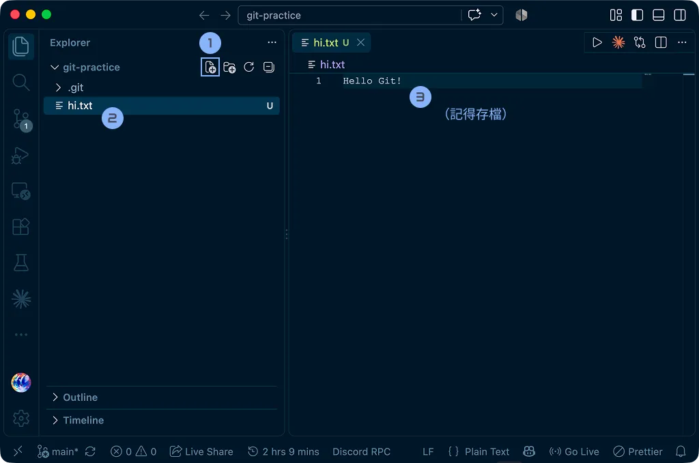
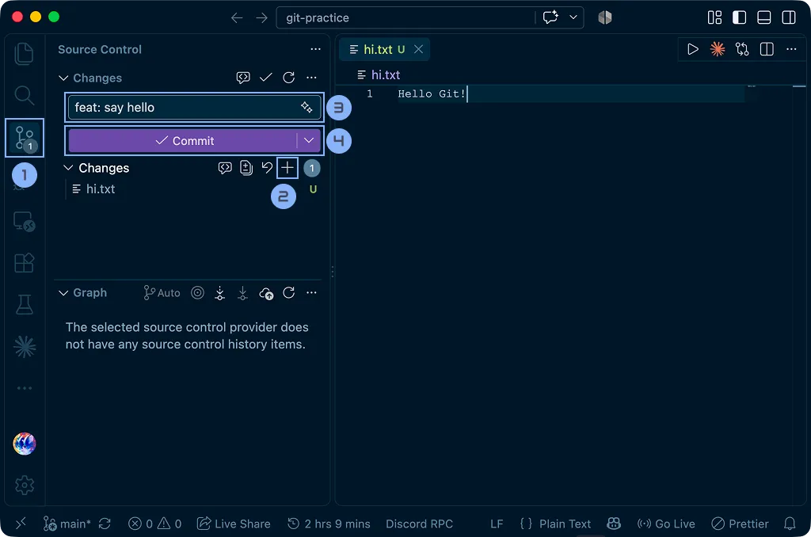

# Git & GitHub

從 `final-final` 到真正的版本控制

毛哥EM


---
src: ../global/me.md
---

---
layout: statement
class: say
---

<div class="eyebrow">文章教學</div>

這份簡報可以搭配文章一起服用

<div class="sub mt-6">
<a href="https://emtech.cc/course/frontend/git/">emtech.cc/course/frontend/git</a>
</div>

---
layout: statement
class: say
---

你們用過 Git / GitHub 嗎？

---
layout: image
---


---
layout: image
---


---
layout: image
---


---
layout: image
---


---
layout: statement
class: say
---

過了一個禮拜，你自己也搞不清楚

<p>哪一個才是最後一個版本。</p>

---
layout: statement
class: say
---

恭喜你，其實你已經在做版本控制了。

<p v-click class="muted">只是做得挺糟的。</p>

---

<div class="eyebrow">Today</div>

## 今天會講什麼？

<div class="grid grid-cols-4 gap-4 mt-6">
<div class="card">
<ph-lightbulb class="card-icon" />
<h3>觀念</h3>
<p class="dim">為什麼需要版本控制<br />Git 與 GitHub<br />Repository、Commit</p>
</div>
<div class="card">
<ph-package class="card-icon" />
<h3>寄包裹</h3>
<p class="dim">clone、status<br />add、commit<br />push、pull</p>
</div>
<div class="card">
<ph-git-branch class="card-icon" />
<h3>平行世界</h3>
<p class="dim">Branch<br />Merge<br />Merge Conflict</p>
</div>
<div class="card">
<ph-users-three class="card-icon" />
<h3>團隊協作</h3>
<p class="dim">Remote、Fork<br />Pull Request、Code Review<br />Merge、Rebase、Squash</p>
</div>
</div>

<p class="lead !mt-10">今天你不太可能背完 Git 所有指令。只希望下課之後，你知道：<strong>自己的修改現在到底在哪裡。</strong></p>

---
layout: section
---

<div class="eyebrow">Chapter 01</div>

# 為什麼需要版本控制？

---
layout: statement
class: say
---

昨天，你的網站還可以跑。

<p v-click>今天你想說：<em>「這裡稍微重構一下好了。」</em></p>

---
layout: statement
class: say
---

兩個小時之後，網站炸了。

<p v-click class="muted">「等一下，昨天到底長怎樣？」</p>

---
layout: statement
class: say
---

瘋狂 <kbd>Ctrl</kbd> + <kbd>Z</kbd>

<p v-click class="muted">但也回不到原本的樣子了。</p>

---
layout: statement
class: say
---

<div class="eyebrow">如果我們有辦法知道</div>

<div class="ask">
<p v-click>這個專案以前長什麼樣子？</p>
<p v-click>哪一天改了什麼？</p>
<p v-click>是誰改的？</p>
<p v-click>為什麼改？</p>
<p v-click>改壞了，能不能回去？</p>
</div>

---
layout: statement
class: say
---

這就是**版本控制**想解決的問題。

<p class="sub !mt-4">Version Control</p>

---
clicks: 6
---

<div class="eyebrow">最原始的版本控制</div>

## 複製一份就好了吧？

<CopyStack :step="$clicks" class="mt-6" />

---

<div class="eyebrow">Problems</div>

## 問題也開始出現了

<div class="grid grid-cols-2 gap-6 mt-6">
<div v-click class="card">
<div class="eyebrow">01</div>
<h3>根本不知道每個版本差在哪</h3>
<p class="dim">project-final 跟 project-final-2 到底改了什麼？只能靠記憶力。</p>
</div>
<div v-click class="card">
<div class="eyebrow">02</div>
<h3>每次都整包複製，超浪費空間</h3>
<p class="dim">一個網站有幾百個程式碼檔案、圖片、字型、套件、編譯結果、設定檔。改一點就複製一次，SSD 一下就炸了。</p>
</div>
</div>

<p v-click class="lead !mt-10">而且這還只是<strong>一個人</strong>。</p>

---
layout: statement
class: say
---

如果今天有<strong>十個人</strong>一起寫呢？

---

<div class="eyebrow">Teamwork</div>

## 你、海鷗、Ben 三個人一起做專案

<div class="grid grid-cols-3 gap-5 mt-8">
<div v-click class="card text-center">
<ph-user-circle class="card-icon" />
<h3>你</h3>
<p class="dim">改了一份</p>
</div>
<div v-click class="card text-center">
<ph-user-circle class="card-icon" />
<h3>海鷗</h3>
<p class="dim">也改了一份</p>
</div>
<div v-click class="card text-center">
<ph-user-circle class="card-icon" />
<h3>Ben</h3>
<p class="dim">也改了一份</p>
</div>
</div>

<p v-click class="lead !mt-10 text-center">到了晚上大家說：<em>「好，現在把大家的版本合起來。」</em></p>

---
layout: statement
class: say
---

請問，怎麼合併？

<p v-click class="muted">Email？Discord？LINE 傳 ZIP？</p>

<div v-click class="flex flex-col items-center gap-3 mt-10">
<span class="pill">project-final-use-this-one.zip</span>
<span class="pill">project-final-use-this-one-new.zip</span>
</div>

---
layout: statement
class: say
---

三天後，發現某一段 Code 長得非常可疑。

<div class="grid grid-cols-2 gap-4 mt-10 max-w-160 mx-auto text-left text-xl">
<div v-click class="bubble">「誰寫的？」</div>
<div v-click class="bubble">「什麼時候寫的？」</div>
<div v-click class="bubble">「為什麼這樣寫？」</div>
<div v-click class="bubble">「那可以改掉嗎？」</div>
</div>

<p v-click class="muted !mt-10">全部都不知道。</p>

---
layout: statement
---

introducing...

---
layout: statement
class: say
---

# Git

---

<div class="eyebrow">What is Git</div>

## Git 是一套版本控制系統

<p class="lead">它會幫我們記錄專案的修改歷史，讓我們知道：</p>

<div class="grid grid-cols-5 gap-3 mt-6">
<div v-click class="card text-center">
<ph-pencil-simple class="card-icon" />
<p>改了什麼</p>
</div>
<div v-click class="card text-center">
<ph-user class="card-icon" />
<p>誰改的</p>
</div>
<div v-click class="card text-center">
<ph-clock class="card-icon" />
<p>什麼時候改的</p>
</div>
<div v-click class="card text-center">
<ph-chat-circle-text class="card-icon" />
<p>為什麼改</p>
</div>
<div v-click class="card text-center">
<ph-clock-counter-clockwise class="card-icon" />
<p>以前長什麼樣子</p>
</div>
</div>

<p v-click class="lead !mt-10">而更重要的是：讓很多人可以<strong>同時開發同一個專案</strong>，再把成果整合起來。</p>

---
clicks: 3
---

<div class="eyebrow">Origin</div>

## Git 是怎麼出生的？

<Steps class="mt-8" mode="reveal" :step="$clicks" :cols="4" :items="[{ t: 'Linux Kernel', d: '超大型開源專案，安卓手機背後就是它。早期靠 Patch、壓縮檔、Email 交換修改' }, { t: 'BitKeeper', d: '後來改用這套分散式版本控制系統' }, { t: '2005 年', d: 'Linux 社群和 BitKeeper 背後的公司關係出現問題' }, { t: 'Linus Torvalds', d: '看了一輪都不滿意，於是：「那我自己寫一個。」' }]" />

---
layout: fact
---

# 10 天

Git 就這樣誕生了。

<p class="muted !mt-6">今天它已經是軟體開發世界最普遍的版本控制工具之一。</p>

---
clicks: 2
---

<div class="eyebrow">Architecture</div>

## 版本控制的三種架構

<VcsModels :step="$clicks" />

---
layout: statement
class: say
---

<div class="eyebrow">DVCS</div>

**D**istributed **V**ersion **C**ontrol **S**ystem

<p class="sub !mt-4">每個開發者的電腦裡，都有一份完整的 Repository 歷史。沒有網路，你依然可以：</p>

<div class="flex justify-center gap-3 mt-6">
<span v-click class="pill">修改程式</span>
<span v-click class="pill">查看歷史</span>
<span v-click class="pill">建立分支</span>
<span v-click class="pill">Commit</span>
</div>

---
layout: section
---

<div class="eyebrow">Chapter 02</div>

# Repository 與 Commit

---

<div class="grid grid-cols-[1fr_300px] gap-14 items-center">
<div>

<div class="eyebrow">Repository</div>

## 專案的時光機

一個被 Git 管理的專案，叫做 **Repository**，簡稱 **Repo**。

<p class="dim">中文常翻成儲存庫、倉庫、程式碼倉庫，你爽就好。</p>

<p v-click class="lead !mt-6">它不只是現在這一份檔案，還包含 Git 記錄下來的<strong>版本歷史</strong>。</p>

</div>
<div v-click class="card grid grid-cols-2 gap-5 p-6">
<Parcel label="A" />
<Parcel label="B" />
<Parcel label="C" />
<Parcel label="D" />
<div class="col-span-2 text-center muted text-sm">版本歷史裡的每一個節點，就叫 Commit</div>
</div>
</div>

---
clicks: 5
---

<div class="eyebrow">Commit</div>

## 每個 Commit，都是一個版本的存檔點

<p class="dim !-mt-2">可以想成專案在某個時間點的一張快照。</p>

<History :step="$clicks" />

---
layout: section
---


<div class="eyebrow">Chapter 03</div>

# 用「寄包裹」理解 Git

<p class="muted">「我只是想存個檔，為什麼要做這麼多事情？」</p>

---

<div class="eyebrow">Analogy</div>

## Git 就像寄包裹

<div class="grid grid-cols-[1fr_200px] gap-12 items-center">
<div class="table-clean">

| Git               | 寄包裹                   |
| ----------------- | ------------------------ |
| `git clone`       | 把完整專案複製到你的電腦 |
| Working Directory | 你的工作桌               |
| `git add`         | 把這次想寄的東西放進箱子 |
| Staging Area      | 箱子裡準備寄出的內容     |
| `git commit`      | 封箱，建立正式紀錄       |
| Commit Message    | 在箱子上寫這次改了什麼   |
| Remote            | 收件地址                 |
| `git push`        | 把包裹寄出去             |
| `git pull`        | 把遠端的新東西拿回來整合 |

</div>
<div>
<Parcel label="feat: say hello" />
</div>
</div>

---
clicks: 4
---

<div class="eyebrow">The Journey</div>

## 一個包裹的旅程

<ParcelFlow :step="$clicks" />

---
layout: section
---

<div class="eyebrow">Chapter 04</div>

# 一步一步，寄出第一個包裹

---

<div class="eyebrow">Step 1 · 拿到專案</div>

## `git clone`：先把專案拿回來

<p class="lead">要編輯一個既有專案，第一件事當然是：<strong>先拿到它</strong>。</p>

```bash
git clone https://github.com/USERNAME/git-workshop.git
cd git-workshop
```

<div class="grid grid-cols-2 gap-5 mt-6">
<div v-click class="card">
<h3>就是 Minecraft 的 <code>/clone</code></h3>
<p class="dim">克隆、複製。</p>
</div>
<div v-click class="card">
<h3>不只下載現在的檔案</h3>
<p class="dim">連 Git 的版本歷史一起抓下來。</p>
</div>
</div>

---
layout: statement
class: say
---

<div class="eyebrow">Step 2 · 修改檔案</div>

這一段跟 Git 沒什麼關係。

<p>你<strong>正常寫程式</strong>就好。</p>

<div v-click class="flex justify-center items-center gap-4 mt-10">
<span class="pill">hi.txt</span>
<ph-arrow-right class="muted" />
<span class="pill">Hello Git!</span>
</div>

---

<div class="eyebrow">Step 2 · 看狀態</div>

## `git status`：我是誰？我在哪？發生什麼事？

<div class="grid grid-cols-[250px_1fr] gap-8 mt-4 items-center">
<div>

```bash
git status
```

<p class="lead !mt-4">這個指令<strong>超級重要</strong>。</p>

<p class="dim">如果哪天不知道 Git 現在到底在幹嘛，先打它。</p>

</div>
<div v-click>

```text
On branch main

No commits yet

Untracked files:
  (use "git add <file>..." to include in what will be committed)
        hi.txt

nothing added to commit but untracked files present (use "git add" to track)
```

</div>
</div>

---
clicks: 1
---

<div class="eyebrow">Step 3 · 裝箱</div>

## `git add`：把東西放進箱子

<ParcelFlow :step="$clicks" />

---

<div class="eyebrow">Stage</div>

## 這個動作叫做 Stage

<div class="grid grid-cols-2 gap-10 mt-4 items-center">
<div>

被 Stage 的內容，會進到 **Staging Area**，也就是我們說的箱子。

<p v-click class="dim !mt-6">你的工作桌上可能改了十個檔案，但這次只想寄三個？沒問題，只 Add 那三個。</p>

</div>
<div>

```bash {1-2|4-5|7-8}
# 只放一個
git add hi.txt

# 一次放三個
git add index.html style.css script.js

# 好啦，這邊全部裝箱
git add .
```

</div>
</div>

---
layout: statement
class: say
---

<div class="eyebrow">裝箱前，先看一眼</div>

`git add .` 很好用。

<p v-click class="muted">但哪天不小心把 <code>.env</code>、API Key、密碼，甚至某個 4GB 的奇怪檔案一起加進去——</p>

<p v-click>你可能會獲得一個很有教育意義的快樂下午。</p>

<p v-click class="sub !mt-6">所以正式專案裡，先 <code>git status</code> 看一下。</p>

---
clicks: 1
---

<div class="eyebrow">Step 4 · 封箱</div>

## `git commit`：封箱

<ParcelFlow :step="1 + $clicks" />

---

<div class="eyebrow">Commit Message</div>

## 在箱子上寫：這一版到底做了什麼？

<div class="grid grid-cols-2 gap-10 mt-4 items-center">
<div>

```bash
git commit -m "feat: say hello"
```

```text
add login page
fix: correct navbar layout
docs: update README
refactor: simplify auth logic
```

</div>
<div>

Git 本身沒有規定格式。你想寫 `fix bug`，技術上也可以。

<p v-click class="dim !mt-6">不過跟你合作的人，以及幾個月後的你，看到可能會很痛苦。</p>

</div>
</div>

---

<div class="eyebrow">Style</div>

## 常見的 Commit Message 風格

<div class="grid grid-cols-2 gap-6 mt-4">
<div class="card">
<div class="eyebrow">Conventional Commits</div>

```text
feat: 新功能
fix: 修 Bug
docs: 文件
refactor: 重構
test: 測試
chore: 雜項維護
```

<p class="dim !mt-3"><a href="https://www.conventionalcommits.org/">conventionalcommits.org</a></p>
</div>
<div class="card">
<div class="eyebrow">Linux Kernel / Git Style</div>

```text
storybook: clarify build ownership
web/routes: split route-level chunks
ui/field: fix select menu positioning
```

<p class="dim !mt-3">前面寫功能的影響範圍，後面解釋在幹嘛。我自己比較喜歡這種。</p>
</div>
</div>

<p class="muted !mt-6 text-center">這都是風格問題，自己習慣就好。</p>

---

<div class="eyebrow">寄件人</div>

## 第一次使用 Git：先設定你的名字

<div class="grid grid-cols-2 gap-10 mt-4 items-center">
<div>

寄包裹，上面當然要寫**寄件人**。

<p class="dim">一台電腦寄出去的人基本上都是你，所以設定在 <code>--global</code>，每個專案都會自動帶上。</p>

<p v-click class="dim !mt-6">注意：這<strong>不是</strong> GitHub 的帳號密碼，只是 Commit 上的作者資訊。</p>

</div>
<div>

```bash
# 記得改成你自己的
git config --global user.name "Elvis Mao"
git config --global user.email "you@example.com"

# 檢查
git config --global --list
```

</div>
</div>

---
layout: statement
class: say
---

`git add`、`git commit`

<p>其實都還只是在<strong>你自己的電腦</strong>。</p>

<p v-click class="muted">包好了，但還沒寄出去。</p>

---
clicks: 1
---

<div class="eyebrow">Step 5 · 寄出</div>

## `git push`：寄出去

<ParcelFlow :step="2 + $clicks" />

---

<div class="eyebrow">First Push</div>

## 第一次 Push 某條 Branch

```bash
git push -u origin main
```

<div class="grid grid-cols-3 gap-4 mt-6">
<div v-click class="card">
<div class="mono good">origin</div>
<p class="!mt-1">Remote 的名字：<strong>寄到哪</strong></p>
</div>
<div v-click class="card">
<div class="mono good">main</div>
<p class="!mt-1">Branch 的名字：<strong>寄哪一條</strong></p>
</div>
<div v-click class="card">
<div class="mono good">-u</div>
<p class="!mt-1">記住這個組合，之後直接 <code>git push</code> 就好</p>
</div>
</div>

<p class="muted !mt-8">Remote 和 Branch，等等會再詳細講。</p>

---
clicks: 1
---

<div class="eyebrow">Step 6 · 收件</div>

## `git pull`：把別人的更新拿回來

<ParcelFlow :step="3 + $clicks" />

---
layout: statement
class: say
---

<div class="eyebrow">Note</div>

很多教學會說 `git pull` 就是下載。

<div v-click class="pull-eq mt-10">
<span class="pill">git pull</span>
<span class="muted">=</span>
<div class="card">
<div class="muted text-sm">取得</div>
<div>Remote 的新資料</div>
</div>
<span class="muted">+</span>
<div class="card">
<div class="muted text-sm">整合</div>
<div>到目前的 Branch</div>
</div>
</div>

<p v-click class="sub !mt-10">也正因為有「整合」，等等才會出現 Git 最經典的場景：<strong>Merge Conflict</strong></p>

---

<div class="eyebrow">Daily Loop</div>

## Git 最基本的日常流程

<div class="grid grid-cols-[1fr_300px] gap-10 items-center mt-2">
<div>

```bash {1-2|3|4|5|6|7|8-9}
git clone <url>
cd <project>
# 修改檔案
git status
git add .
git commit -m "feat: do something"
git push
# 別人有更新
git pull
```

</div>
<div class="swap">
<p class="swap-item lead" :class="{ 'is-on': $clicks === 0 }">拿到專案</p>
<p class="swap-item lead" :class="{ 'is-on': $clicks === 1 }">正常寫 Code</p>
<p class="swap-item lead" :class="{ 'is-on': $clicks === 2 }">看看發生什麼事</p>
<p class="swap-item lead" :class="{ 'is-on': $clicks === 3 }">裝箱</p>
<p class="swap-item lead" :class="{ 'is-on': $clicks === 4 }">封箱、寫上說明</p>
<p class="swap-item lead" :class="{ 'is-on': $clicks === 5 }">寄出去</p>
<p class="swap-item lead" :class="{ 'is-on': $clicks >= 6 }">如果你只先學會這幾個，其實已經能做<strong>非常多事情</strong>。</p>
</div>
</div>

---
layout: section
---

<div class="eyebrow">Chapter 05</div>

# 那 GitHub 又是什麼？

---
layout: statement
class: say
---

# Git ≠ GitHub

---

<div class="eyebrow">Git vs GitHub</div>

## 一個是軟體，一個是平台

<div class="grid grid-cols-2 gap-6 mt-4">
<div class="card">
<ph-git-branch class="card-icon" />
<h3>Git</h3>
<p class="lead">版本控制<strong>軟體</strong></p>
<ul class="dim">
<li>跑在你的電腦上</li>
<li>沒有 GitHub，Git 一樣能用</li>
<li>管理 Commit、Branch、Merge</li>
</ul>
</div>
<div class="card">
<ph-github-logo class="card-icon" />
<h3>GitHub</h3>
<p class="lead">線上程式碼<strong>託管與協作平台</strong></p>
<ul class="dim">
<li>建立在 Git 的工作流程上</li>
<li>Pull Request、Issue、Actions</li>
<li>類似的還有 GitLab、Bitbucket、自架 Git Server</li>
</ul>
</div>
</div>

<p v-click class="dim !mt-8 text-center">GitHub 哪天掛掉（最近常常），你本機的 Repository 也不會瞬間蒸發。</p>

---

<div class="eyebrow">Social Coding</div>

## GitHub 很像工程師的 Facebook、IG

<p class="dim">社群媒體上大家發照片，GitHub 上大家發 Code。</p>

<div class="grid grid-cols-5 gap-3 mt-6">
<div v-click class="card text-center">
<div class="muted text-sm">發文</div>
<ph-git-commit class="card-icon mt-3" />
<p>Commit、專案</p>
</div>
<div v-click class="card text-center">
<div class="muted text-sm">留言</div>
<ph-chat-circle-dots class="card-icon mt-3" />
<p>Issue、Discussion</p>
</div>
<div v-click class="card text-center">
<div class="muted text-sm">按讚</div>
<ph-star class="card-icon mt-3" />
<p>Star</p>
</div>
<div v-click class="card text-center">
<div class="muted text-sm">收藏</div>
<ph-git-fork class="card-icon mt-3" />
<p>Fork</p>
</div>
<div v-click class="card text-center">
<div class="muted text-sm">追蹤</div>
<ph-eye class="card-icon mt-3" />
<p>Watch、Follow</p>
</div>
</div>

<p v-click class="dim !mt-8">這也是為什麼 GitHub 在開源世界這麼重要。</p>

---

<div class="eyebrow">License</div>

## GitHub 不代表「全部都是開源」

<div class="grid grid-cols-2 gap-10 mt-4 items-center">
<div>

GitHub 可以有 **Private Repository**。

就算 Repository 是 Public，也不代表你可以隨便拿它的 Code 來用。

<p class="dim !mt-4">真正決定你能怎麼用的，是 <strong>License</strong>。</p>

</div>
<div class="card">
<ul>
<li v-click>可以修改嗎？</li>
<li v-click>可以商業使用嗎？</li>
<li v-click>可以重新發布嗎？</li>
<li v-click>修改後要不要開源？</li>
<li v-click>要不要保留原作者聲明？</li>
</ul>
</div>
</div>

<p v-click class="lead !mt-10 text-center">Public 只是「看得到」，不是「你想幹嘛都可以」。</p>

---

<div class="eyebrow">Open Source</div>

## 其實你每天都在使用開源軟體

<div class="flex flex-wrap gap-3 mt-6">
<span class="pill">Linux</span>
<span class="pill">Git</span>
<span class="pill">React</span>
<span class="pill">Vue</span>
<span class="pill">Blender</span>
<span class="pill">OBS Studio</span>
<span class="pill">Chromium</span>
<span class="pill">Code - OSS（VS Code 的開源版本）</span>
<span class="pill">大量 JavaScript、Python、Rust、Go 套件</span>
</div>

<div v-click class="mt-10">

```bash
npm install
```

</div>

<p v-click class="lead !mt-4">你打下這一行，後面都靠著幾百、幾千個你這輩子沒見過的人。</p>

---
layout: section
---

<div class="eyebrow">Chapter 06</div>

# 實作時間

<p class="muted">把你的第一個包裹寄上 GitHub</p>

---

<div class="eyebrow">Sign up</div>

## 建立 GitHub 帳號

<div class="grid grid-cols-2 gap-10 mt-4 items-center">
<div>

進入 GitHub 官網，右上角 **Sign up**，照畫面完成註冊與 Email 驗證。

<p v-click class="dim !mt-6">比較值得注意的是：<strong>Username 好好取。</strong>之後雖然還能改，但可能影響原本的網址、設定和外部服務。</p>

</div>
<div>

```text
github.com/你的名字
github.com/你的名字/project
別人 @你的名字
你的名字.github.io
```

</div>
</div>

---

<div class="eyebrow">Install</div>

## 安裝 Git

<div class="grid grid-cols-[1fr_1.2fr] gap-8 mt-4 items-center">
<div>

打開終端機（或 PowerShell、CMD），輸入：

```bash
git
```

<p class="dim !mt-4">看到一長串使用說明，就代表已經裝好了。</p>

<p class="dim">沒有的話，可以到 <a href="https://git-scm.com/">git-scm.com</a> 下載。完全新手用預設值一路下一步，今天通常就夠用。</p>

</div>
<div>

```bash
# macOS（Homebrew）
brew install git

# Windows（winget）
winget install --id Git.Git -e --source winget

# Ubuntu / Debian
sudo apt update
sudo apt install git

# Fedora
sudo dnf install git
```

</div>
</div>

---

<div class="eyebrow">New repository</div>

## 建立第一個 Repository

<div class="grid grid-cols-[1fr_280px] gap-10 items-center">
<div>

<p class="dim">登入後，右上角 <strong>+</strong> → <strong>New repository</strong></p>

<div class="table-clean">

| 設定             | 今天怎麼選 |
| ---------------- | ---------- |
| Repository name  | 專案名稱   |
| Description      | 專案說明   |
| Public / Private | Public     |
| README           | 先關閉     |
| `.gitignore`     | 先關閉     |
| License          | 先關閉     |

</div>

<p class="dim !mt-2">最後按 <strong>Create repository</strong>，完成。</p>

</div>

</div>

---

<div class="eyebrow">Good to know</div>

## 順便認識 `.gitignore` 與 License

<div class="grid grid-cols-2 gap-6 mt-4">
<div class="card">
<div class="mono good">.gitignore</div>
<h3 class="mt-1">告訴 Git：這些東西不要管</h3>

```text
node_modules/
.env
.DS_Store
```

<p class="dim !mt-3"><code>.env</code> 常常有 API Key、Token、資料庫密碼，不應該被 Commit 公開出來。</p>
</div>
<div class="card">
<div class="mono good">LICENSE</div>
<h3 class="mt-1">告訴別人：可以怎麼使用你的 Code</h3>
<p class="dim !mt-3">還記得嗎？Public 只是看得到，能怎麼用要看 License。</p>
</div>
</div>

<p v-click class="dim !mt-6"><strong>Secret 一旦 Push 到公開 Repo</strong>，不要只刪檔案，請直接把它作廢並重新產生。</p>

---

<div class="eyebrow">Clone</div>

## Clone 你的 Repository

<div class="grid grid-cols-[minmax(0,1fr)_460px] gap-8 items-center mt-2">
<div>

1. 選擇 **HTTPS**
2. 複製 Git URL（直接複製網址，沒有 `.git` 也行）
3. 打開 Terminal，Clone 下來

<p class="dim">現在 Repository 已經在你的電腦裡了。</p>

</div>

</div>

```bash
git clone https://github.com/USERNAME/git-workshop.git
```

---

<div class="eyebrow">VS Code</div>

## 用 VS Code 編輯

<div class="grid grid-cols-[minmax(0,1fr)_480px] gap-8 items-center mt-2">
<div>

1. 打開剛才 Clone 的資料夾
2. 建立 `hi.txt`，隨便打點東西，存檔
3. 打開左邊的 **Source Control**

<p class="dim !mt-4"><kbd>Ctrl</kbd> <kbd>Shift</kbd> <kbd>G</kbd>（macOS 也是 Control）</p>

<p v-click class="dim !mt-4">Changes 底下出現 <code>hi.txt</code>，代表 VS Code 已經透過 Git 發現檔案有變更。</p>

</div>

</div>

---
clicks: 3
---

<div class="eyebrow">VS Code</div>

## 用 VS Code 做第一次 Commit

<div class="grid grid-cols-[minmax(0,1fr)_480px] gap-8 items-center mt-2">
<Steps :cols="1" mode="reveal" :step="$clicks" :items="[{ t: '打開 Source Control' }, { t: '按 Changes 旁邊的 +', d: '= git add hi.txt' }, { t: '輸入 Commit Message', d: 'feat: say hello' }, { t: '按 Commit', d: '= git commit -m &quot;feat: say hello&quot;' }]" />

</div>

<p class="dim !mt-6">Source Control 基本上就是把 Git 指令包成按鈕。用 GUI 還是 Terminal，本質是一樣的。</p>

---
layout: statement
class: say
---

<div class="eyebrow">Commit 失敗？</div>

`Author identity unknown`

<p class="sub !mt-4">代表還沒設定寄件人。回去設定 <code>user.name</code> 和 <code>user.email</code> 就好。</p>

---
clicks: 5
---

<div class="eyebrow">Push</div>

## 恭喜，你寄出了第一個包裹

<p class="dim">在 VS Code 直接按 <strong>Push</strong>，或在 Terminal 打 <code>git push</code>。回 GitHub 重新整理，就會看到 <code>hi.txt</code>。</p>

<Steps class="mt-6" :step="$clicks" :items="['本機修改', 'Stage', 'Commit', 'Push', 'GitHub']" />

<div v-click="5" class="mt-6">

```bash
git status
git add hi.txt
git commit -m "feat: say hello"
git push
```

</div>

---

<div class="eyebrow">Must know</div>

## 幾個一定要知道的 Git 指令

<div class="grid grid-cols-3 gap-5 mt-4">
<div class="card">
<div class="mono good">git status</div>
<p class="!mt-1">看目前 Repository 的狀態</p>
</div>
<div class="card">
<div class="mono good">git log</div>
<p class="!mt-1">看 Commit 歷史</p>
</div>
<div class="card">
<div class="mono good">git diff</div>
<p class="!mt-1">還沒 Stage 前，看自己到底改了什麼</p>
</div>
</div>

<div v-click class="grid grid-cols-2 gap-5 mt-6 items-center">
<div>

```bash
git log --oneline --graph --all
```

</div>
<div>

```text
* 9ca021a feat: add login
* e83ab31 fix: navbar
* 810ba11 initial commit
```

</div>
</div>

---
layout: section
---

<div class="eyebrow">Chapter 07</div>

# Branch

<p class="muted">不要直接在正式版本上面亂搞</p>

---
layout: statement
class: say
---

正式上線的版本放在 `main`。

<p v-click>你當然可以直接在 <code>main</code> 上改。</p>

<p v-click class="muted">就像你也可以 SSH 進正式 Server 改 Production。</p>

<p v-click class="muted">技術上做得到。但通常我們希望你不要。</p>

---
clicks: 3
---

<div class="eyebrow">Branch</div>

## 從 `main` 開一條平行世界

<GitGraph preset="branch" :step="$clicks" class="mt-4" />

---

<div class="eyebrow">Create</div>

## 建立 Branch

<div class="grid grid-cols-2 gap-10 mt-6 items-center">
<div>

```bash
git switch -c dev
```

<p class="lead !mt-4"><code>-c</code> 就是 <strong>Create</strong>：建立並切換過去。</p>

</div>
<div class="card">
<div class="muted text-sm">舊教學可能會看到</div>

```bash
git checkout -b dev
```

<p class="dim !mt-3">也可以。但新手建議先用 <code>git switch</code>，語意比較清楚。</p>
</div>
</div>

---
clicks: 4
---

<div class="eyebrow">Switch</div>

## 在 Branch 裡面工作

<GitGraph preset="switch" :step="$clicks" />

---
layout: statement
class: say
---

<div class="eyebrow">Push a branch</div>

第一次把這條 Branch 寄上 GitHub

<div class="mt-8 flex justify-center">

```bash
git push -u origin dev
```

</div>

<div v-click class="flex justify-center gap-3 mt-8 text-xl">
<span class="pill">main</span>
<span class="pill good">dev</span>
</div>

---
clicks: 3
---

<div class="eyebrow">Merge</div>

## 把 Branch 合回去

<div class="grid grid-cols-[1fr_1fr] gap-10 items-center mt-4">
<div>

```bash {1|2|3|4}
git switch main
git pull
git merge dev
git push
```

<div class="swap mt-4">
<p class="swap-item dim" :class="{ 'is-on': $clicks === 0 }">先站到<strong>要接收修改</strong>的 main</p>
<p class="swap-item dim" :class="{ 'is-on': $clicks === 1 }">團隊專案先 pull，確保 main 是最新的</p>
<p class="swap-item dim" :class="{ 'is-on': $clicks === 2 }">把 dev 合進我目前所在的 main</p>
<p class="swap-item dim" :class="{ 'is-on': $clicks >= 3 }">成功之後寄出去，完成</p>
</div>

</div>
<div class="card">
<div class="muted text-sm">記法</div>
<p class="lead !mt-2">把「<strong>指定的 Branch</strong>」</p>
<p class="lead">合進「<strong>我現在所在的 Branch</strong>」。</p>
</div>
</div>

---
layout: section
---

<div class="eyebrow">Chapter 08</div>

# Merge Conflict

<p class="muted">Git：「這兩個答案，我不敢幫你猜。」</p>

---
layout: statement
class: say
---

理想世界裡，Merge 很漂亮。

<div class="grid grid-cols-2 gap-5 mt-10 max-w-180 mx-auto text-left">
<div v-click class="card">
<div class="muted text-sm">海鷗</div>
<div class="text-xl mt-1">把第 10 行改成 <strong>A</strong></div>
</div>
<div v-click class="card">
<div class="muted text-sm">Ben</div>
<div class="text-xl mt-1">把<strong>同一行</strong>改成 <strong>B</strong></div>
</div>
</div>

<p v-click class="!mt-10">Git：<em>「你們兩個自己打完之後跟我說。」</em></p>

---
clicks: 3
---

<div class="eyebrow">Try it</div>

## 故意做一個 Conflict

<GitGraph preset="conflict" :step="$clicks" />

---
clicks: 2
---

<div class="eyebrow">CONFLICT</div>

## 檔案裡會看到這個

<div class="grid grid-cols-[1fr_300px] gap-10 items-center mt-4">
<div class="swap">
<div class="swap-item" :class="{ 'is-on': $clicks === 0 }">

<!-- 衝突標記開頭的 <<< 會被 Slidev 當成 snippet 語法，所以放在獨立檔案匯入 -->

<<< ./snippets/conflict.txt text

</div>
<div class="swap-item" :class="{ 'is-on': $clicks === 1 }">

```text
main 說這行應該是：
Hello from main!

dev 說這行應該是：
Hello from dev!

你決定。
```

</div>
<div class="swap-item" :class="{ 'is-on': $clicks >= 2 }">

```text
Hello from both branches!
```

</div>
</div>
<div class="swap">
<p class="swap-item lead" :class="{ 'is-on': $clicks === 0 }">Git 把兩個版本都標出來</p>
<p class="swap-item lead" :class="{ 'is-on': $clicks === 1 }">翻成人話</p>
<p class="swap-item lead" :class="{ 'is-on': $clicks >= 2 }">留下某一邊，或自己改成真正想要的內容</p>
</div>
</div>

<p class="dim !mt-8">Git 不自己猜，其實是好事。因為它不知道你們誰才是對的。</p>

---

<div class="eyebrow">Resolve</div>

## 用 VS Code 解 Conflict

<div class="grid grid-cols-2 gap-10 mt-4 items-center">
<div>

<p class="lead">這種時候非常推薦用 VS Code。它會把 Conflict 標出來，並提供：</p>

<div class="flex flex-wrap gap-2 mt-4">
<span class="pill">Accept Current</span>
<span class="pill">Accept Incoming</span>
<span class="pill">Accept Both</span>
<span class="pill">Compare Changes</span>
</div>

</div>
<div>

<p class="dim">改完後：</p>

```bash
git add hi.txt
git commit
git push
```

<p class="dim !mt-4">衝突就解決了。</p>

</div>
</div>

---
layout: statement
class: say
---

Conflict 不是 Git 壞掉。

<p v-click class="muted">而是 Git 在說：「這裡有兩個答案，我不敢亂猜。」</p>

---
layout: section
---

<div class="eyebrow">Chapter 09</div>

# Remote

<p class="muted">前面一直 git push，Git 到底怎麼知道要寄去哪？</p>

---

<div class="eyebrow">Remote</div>

## 收件地址：Remote

<div class="grid grid-cols-[1fr_1fr] gap-8 mt-4 items-center">
<div>

```bash
git remote -v
```

</div>
<div>

```text
origin  https://github.com/elvis/project.git (fetch)
origin  https://github.com/elvis/project.git (push)
```

</div>
</div>

<div class="grid grid-cols-2 gap-5 mt-6">
<div v-click class="card">
<h3><code>origin</code> 只是名字</h3>
<p class="dim">Clone 時大家慣用的預設名稱。你要叫它 <code>banana</code> 也不是不行。</p>
</div>
<div v-click class="card">
<h3>為什麼 Clone 完就有？</h3>
<p class="dim">因為專案本來就是從那裡 Clone 下來的。Git 記得：「喔，這份專案原本來自這裡。」</p>
</div>
</div>

---

<div class="eyebrow">Remote add</div>

## 手動加入 Remote

<div class="grid grid-cols-[1fr_320px] gap-8 mt-4 items-center">
<div>

<p class="dim">原本有本機專案，後來才建立 GitHub Repo：</p>

```bash
git remote add origin https://github.com/USERNAME/project.git
git push -u origin main
```

</div>
<div>

<p class="dim">也可以有很多個 Remote：</p>

```bash
git remote add github ...
git remote add gitlab ...
git remote add backup ...
```

</div>
</div>

<p v-click class="lead !mt-10 text-center">所以 Remote 本質上只是：<strong>Git 可以跟哪些遠端 Repository 溝通？</strong></p>

---

<div class="eyebrow">git init</div>

## 本機原本就有專案怎麼辦？

<div class="grid grid-cols-[1fr_280px] gap-8 items-center mt-4">
<div>

```bash {1-2|4-5|7|8|9}
cd my-project
git init

git add .
git commit -m "chore: initial commit"

git remote add origin https://github.com/USERNAME/my-project.git
git branch -M main
git push -u origin main
```

</div>
<div class="swap">
<p class="swap-item lead" :class="{ 'is-on': $clicks === 0 }">不用重新 Clone，直接把資料夾變成 Repository</p>
<p class="swap-item lead" :class="{ 'is-on': $clicks === 1 }">第一次裝箱、封箱</p>
<p class="swap-item lead" :class="{ 'is-on': $clicks === 2 }">在 GitHub 建立空 Repository，加上收件地址</p>
<p class="swap-item lead" :class="{ 'is-on': $clicks === 3 }">需要的話，把 Branch 改名成 main</p>
<p class="swap-item lead" :class="{ 'is-on': $clicks >= 4 }">寄出去。這是非常常見的一套流程</p>
</div>
</div>

---
layout: section
---

<div class="eyebrow">Chapter 10</div>

# 團隊協作

<p class="muted">Pull Request · Fork · Code Review</p>

---
layout: statement
class: say
---

你在 GitHub 看到一個很酷的專案。

<p v-click>結果發現：<em>「欸，這裡有 Bug。」</em></p>

<p v-click class="muted">而且你剛好會修。</p>

<p v-click class="muted">問題是，你不是作者，不能直接 <code>git push</code> 進別人的 Repository。</p>

---

<div class="grid grid-cols-[1fr_230px] gap-14 items-center">
<div>

<div class="eyebrow">Pull Request · PR</div>

## 我想把我的 Code 合進去

> 嗨，我做了一組修改，你願不願意把我的東西合進你的專案？

<p v-click class="dim !mt-8">用包裹來說：不是直接塞進別人家，而是送到門口，<strong>請對方簽收</strong>。</p>

</div>
<div>
<Parcel label="Pull Request" />
</div>
</div>

---

<div class="eyebrow">Same team</div>

## 同一個團隊：Branch → Push → PR

<div class="grid grid-cols-2 gap-10 mt-4 items-center">
<div>

```bash
git switch -c feat/login

git add .
git commit -m "feat: add login"

git push -u origin feat/login
```

<p class="dim !mt-4">本來就有 Repository 權限，通常不用 Fork。</p>

</div>
<div>

<p class="dim">GitHub 通常會跳出 <strong>Compare & pull request</strong>，接著選：</p>

<div class="card mt-4 flex items-center justify-center gap-3">
<span class="pill">base: main</span>
<ph-arrow-left-bold class="muted" />
<span class="pill good">compare: feat/login</span>
</div>

<p class="lead !mt-4">意思就是：我要把 <code>feat/login</code> 合進 <code>main</code>。</p>

</div>
</div>

---

<div class="eyebrow">Fork</div>

## 如果是別人的專案：Fork

<p class="lead">沒有 Write 權限時，就把他的 Repository <strong>複製一份到你的 GitHub 帳號</strong>。</p>

<div class="flex items-center justify-center gap-6 mt-12 text-2xl">
<span class="pill">someone/cool-project</span>
<ph-arrow-right-bold class="muted" />
<span v-click class="pill good">your-name/cool-project</span>
</div>

<p v-click class="dim text-center !mt-10">這一份是你的，你可以自己 Push。</p>

---
clicks: 6
---

<div class="eyebrow">Fork Flow</div>

## 完整的 Fork 流程

<ForkFlow :step="$clicks" />

---

<div class="eyebrow">Commands</div>

## 用指令走一次 Fork 流程

```bash {1-2|3|5|6-7|8}
git clone https://github.com/YOUR-NAME/cool-project.git
cd cool-project
git remote add upstream https://github.com/ORIGINAL-OWNER/cool-project.git

git switch -c fix/awesome-bug
git add .
git commit -m "fix: awesome bug"
git push -u origin fix/awesome-bug
```

<div class="flex items-center gap-4 mt-6">
<span class="pill"><span class="muted">origin</span> 你的 Fork</span>
<span class="pill"><span class="muted">upstream</span> 原作者</span>
<span class="dim ml-2">最後到 GitHub 開 Pull Request。</span>
</div>

---

<div class="eyebrow">Write a good PR</div>

## Pull Request 要寫什麼？

<div class="grid grid-cols-[260px_1fr] gap-8 mt-4 items-center">
<div>

<div class="card">
<div class="muted text-sm">Title</div>
<div class="text-lg mt-1">Fix mobile navbar overflow</div>
</div>

<div v-click class="card mt-4">
<div class="muted text-sm">不要只寫</div>
<div class="bad mono mt-1">fixed bug</div>
</div>

</div>
<div>

```text
修正手機版 Navbar 超出畫面的問題。

原因：
原本 Navbar 使用固定寬度，在 375px 以下會 overflow。

修改：
- 改用 flex-wrap
- 調整手機版 breakpoint
- 補上相關測試
```

</div>
</div>

<p class="dim !mt-6">好的 PR Description，可以讓 Reviewer 好看很多。</p>

---

<div class="eyebrow">Code Review</div>

## 不要看到綠色按鈕就 Merge

<p class="dim">PR 開完，不代表馬上 Merge。Reviewer 會打開 <strong>Files changed</strong> 看你改了什麼，可能留言：</p>

<div class="flex flex-col items-start gap-3 mt-6 text-lg">
<div v-click class="bubble">這裡為什麼這樣寫？</div>
<div v-click class="bubble">這裡是不是可能是 Null？</div>
<div v-click class="bubble">這個變數命名不符合規範</div>
<div v-click class="bubble">為什麼資料庫密碼會出現在這裡？</div>
</div>

---

<div class="eyebrow">Review</div>

## Review 完通常有幾種結果

<div class="grid grid-cols-3 gap-5 mt-4">
<div class="card">
<ph-chat-circle class="card-icon" />
<h3>Comment</h3>
<p class="dim">單純留言</p>
</div>
<div class="card">
<ph-arrows-clockwise class="card-icon" style="color: var(--orange)" />
<h3>Request changes</h3>
<p class="dim">還需要修改</p>
</div>
<div class="card">
<ph-check-circle class="card-icon" style="color: var(--green)" />
<h3>Approve</h3>
<p class="dim">看過了，可以</p>
</div>
</div>

<div v-click class="mt-8">
<p class="lead">比較正式的團隊甚至會設定，全部達成才可以 Merge：</p>
<div class="flex flex-wrap gap-2 mt-3">
<span class="pill">至少一個 Reviewer Approve</span>
<span class="pill">所有測試通過</span>
<span class="pill">Branch 必須是最新</span>
<span class="pill">指定人員必須 Review</span>
</div>
</div>

---
clicks: 6
---

<div class="eyebrow">GitHub Actions</div>

## 叫機器先幫你檢查

<p class="dim">除了人工 Code Review，GitHub Actions 可以在 Push、開 PR、Merge、Release、定時排程時，自動做事。</p>

<Steps class="mt-8" :step="$clicks" :items="['Pull Request', '跑 ESLint', '跑 Test', 'Build', '安全性掃描', '允許 Merge']" />

---

<div class="eyebrow">GitHub Actions</div>

## 甚至：Merge 完直接上線

<Steps class="mt-8" mode="auto" :items="['Merge 到 main', 'Build', 'Deploy', '網站上線']" />

<p class="lead !mt-10">GitHub 不只是放 Code 的地方，它也可以成為<strong>整套團隊開發流程的中心</strong>。</p>

<p class="muted !mt-4 text-sm">想學更多：<a href="https://slides.elvismao.com/talks/actions/">GitHub Actions 簡報</a></p>

---

<div class="eyebrow">Merge options</div>

## PR 的三種 Merge 方法

<p class="dim">Review 完、測試也過了，終於可以按 Merge。但 GitHub 常見有三種做法：</p>

<div class="grid grid-cols-3 gap-5 mt-6">
<div v-click class="card">
<div class="eyebrow">01</div>
<h3>Merge commit</h3>
<p class="dim">保留兩條 Branch 合併的節點</p>
</div>
<div v-click class="card">
<div class="eyebrow">02</div>
<h3>Rebase and merge</h3>
<p class="dim">把 Commit 重新接到最新 main 後面</p>
</div>
<div v-click class="card">
<div class="eyebrow">03</div>
<h3>Squash and merge</h3>
<p class="dim">把很多小 Commit 壓成一個</p>
</div>
</div>

---
clicks: 1
---

<div class="eyebrow">01 · Merge commit</div>

## Merge Commit

<GitGraph preset="merge" :step="$clicks" />

<div class="grid grid-cols-2 gap-5 mt-2 text-center">
<p class="good">＋ 清楚保留兩條 Branch 在這裡合併，歷史很完整</p>
<p class="bad">－ Branch 一多之後，Graph 可能會很亂</p>
</div>

---
clicks: 1
---

<div class="eyebrow">02 · Rebase and merge</div>

## Rebase：拿起來，重新接上去

<GitGraph preset="rebase" :step="$clicks" />

<div class="grid grid-cols-2 gap-5 mt-2 text-center">
<p class="good">＋ 歷史變成一條線，很乾淨</p>
<p class="bad">－ 會重寫 Commit 歷史，多人共用的 Branch 要特別小心</p>
</div>

---
clicks: 2
---

<div class="eyebrow">03 · Squash and merge</div>

## Squash：壓成一個，再放進 main

<div class="grid grid-cols-[240px_1fr] gap-6 items-center mt-2">
<div class="squash-list mono text-sm" :class="{ 'is-squashed': $clicks >= 1, 'is-done': $clicks >= 2 }">
<div>feat: add login</div>
<div>fix: typo</div>
<div>fix: really fix login</div>
<div>fix: pls work</div>
<div>fix: aaa</div>
<div>fix: finally</div>
<div>fix: really finally</div>
<div class="squash-result">feat: add login system</div>
</div>
<GitGraph preset="squash" :step="$clicks" />
</div>

<p class="dim !mt-2">三年後的人看到 <code>fix: aaa</code>，大概很難理解這是什麼珍貴歷史。如果團隊習慣<strong>一個 PR = 一個完整功能</strong>，Squash 會非常舒服。</p>

---

<div class="eyebrow">Workflow</div>

## 一套真正可以拿來用的團隊流程

<Steps class="mt-6" mode="auto" :cols="5" :items="['更新 main', '開 Branch', '開發', 'Commit', 'Push', 'Pull Request', '自動測試', 'Code Review', '修改', 'Approve', 'Merge', '刪 Branch', '重新 Pull']" />

<p class="dim !mt-8">這就是很多軟體團隊每天在做的事情。</p>

---

<div class="eyebrow">Example</div>

## 例如今天要做登入

<div class="grid grid-cols-[1fr_300px] gap-10 items-center mt-4">
<div>

````md magic-move
```bash
# 先更新 main
git switch main
git pull
```

```bash
# 開一條 Branch
git switch -c feat/login
```

```bash
# 開發，一步一步 Commit
git status
git add .
git commit -m "feat: add login form"

git add .
git commit -m "feat: connect login api"
```

```bash
# 寄出去
git push -u origin feat/login
```

```bash
# Review 說還要改
git add .
git commit -m "fix: handle invalid login"
git push
```

```bash
# Merge 之後，回到 main
git switch main
git pull

# 下一個功能，再跑一次
git switch -c feat/profile
```
````

</div>
<div class="swap">
<p class="swap-item lead" :class="{ 'is-on': $clicks === 0 }">每次開工，先確保 main 是最新的</p>
<p class="swap-item lead" :class="{ 'is-on': $clicks === 1 }">一個功能，一條 Branch</p>
<p class="swap-item lead" :class="{ 'is-on': $clicks === 2 }">Commit 本來就可以當 Checkpoint</p>
<p class="swap-item lead" :class="{ 'is-on': $clicks === 3 }">到 GitHub 開 Pull Request</p>
<p class="swap-item lead" :class="{ 'is-on': $clicks === 4 }">同一條 Branch Push 新 Commit，PR 會自動更新，不用重開</p>
<p class="swap-item lead" :class="{ 'is-on': $clicks >= 5 }">然後再跑一次</p>
</div>
</div>

---

<div class="eyebrow">Naming</div>

## Branch 名稱怎麼取？

<div class="grid grid-cols-2 gap-6 mt-4">
<div class="card">
<div class="good mb-2 flex items-center gap-2"><ph-check-circle-fill /> 看名字就知道在幹嘛</div>

```text
feat/login
feat/profile
fix/navbar
fix/payment-timeout
docs/install-guide
refactor/auth
```

</div>
<div class="card">
<div class="bad mb-2 flex items-center gap-2"><ph-x-circle-fill /> 不要</div>

```text
test
test2
mybranch
newnew
aaa
```

</div>
</div>

<p class="dim !mt-6 text-center">團隊可以自己訂。重點不是一定要照格式，而是看到名字就知道這條 Branch 在幹嘛。</p>

---
layout: section
---

<div class="eyebrow">Chapter 11</div>

# 最重要的不是背指令

---
layout: statement
class: say
---

你以後一定會忘記 `git remote add` 怎麼打。

<p v-click>你也一定會 Google <code>git undo last commit</code>。</p>

<p v-click class="muted">完全正常。工程師沒有每天坐在辦公室默背 Git Manual。</p>

---
clicks: 5
---

<div class="grid grid-cols-[1fr_380px] gap-12 items-center">
<div>

<div class="eyebrow">Mental Map</div>

## 真正重要的，是腦袋裡知道

<p class="big !mt-6">我的修改<br />現在在哪？</p>

</div>
<Steps :cols="1" mode="reveal" :step="$clicks" :items="['還只是在 Working Directory？', '已經 Stage？', '已經 Commit？', '在哪條 Branch？', 'Remote 有沒有？', '要把哪條 Branch 合去哪裡？']" />
</div>

---
layout: statement
class: say
---

只要這張地圖建立起來，指令忘記都查得到。

<p v-click class="muted">如果這張地圖不存在，背一百條指令，也只是在施法。</p>

---
layout: statement
class: say
---

最後，想講一件比較不像 Git 教學的事情。

---
layout: statement
class: say
---

<div class="flex justify-center gap-3 mb-10 text-xl">
<span class="pill">git add</span>
<span class="pill">git commit</span>
<span class="pill">git push</span>
</div>

看起來都是很冷冰冰的指令。

---

<div class="eyebrow text-center">打開一個大型 Repository</div>

<div class="grid grid-cols-3 gap-6 mt-10 text-center">
<div v-click>
<div class="num">幾十萬行</div>
<div class="dim mt-2">Code</div>
</div>
<div v-click>
<div class="num">數千個</div>
<div class="dim mt-2">Commit</div>
</div>
<div v-click>
<div class="num">幾百、幾千位</div>
<div class="dim mt-2">Contributor</div>
</div>
</div>

<p v-click class="lead text-center !mt-14">它不是某個人某一天坐下來，一口氣把所有東西寫完的。</p>

---
layout: statement
class: say
---

而是在很多年的時間裡，

<p>一群可能從來沒見過彼此的人，</p>

<p v-click class="muted">一點一點把東西留下來。</p>

---

<div class="eyebrow">Contributors</div>

## 有人……

<div class="grid grid-cols-2 gap-5 mt-4">
<div v-click class="card">
<p class="dim">修了一個 Typo</p>
<div class="mono good mt-2">docs: fix typo</div>
</div>
<div v-click class="card">
<p class="dim">花三個月重寫一個核心功能</p>
<div class="mono good mt-2">feat: new rendering engine</div>
</div>
<div v-click class="card">
<p class="dim">只是覺得「這個按鈕怪怪的。」</p>
<div class="mt-2">所以送了一個 Pull Request</div>
</div>
<div v-click class="card">
<p class="dim">用了某個免費工具很久，某一天突然想：</p>
<div class="mt-2"><em>「它幫了我這麼多，我是不是也可以幫它修點東西？」</em></div>
</div>
</div>

---
layout: statement
class: say
---

下一個人，就站在這些 Commit 上繼續往前走。

<p v-click class="muted">Linux 是這樣。Git 自己也是這樣。</p>

---
layout: statement
class: say
---

Git 最厲害的地方，也許從來不只是可以回到昨天的版本。

<p v-click>而是讓很多彼此不認識的人，可以把自己的工作<strong>接在另一個人的工作後面</strong>。</p>

---
layout: statement
class: say
---

讓修改有歷史。

<p v-click>讓貢獻有紀錄。</p>

<p v-click>讓一個人完成不了的東西，可以由很多人一起完成。</p>

---
layout: statement
class: say
---

<div class="chain">
<div><Parcel label="init" /></div>
<div v-click><Parcel label="fix typo" /></div>
<div v-click><Parcel label="feat" /></div>
<div v-click><Parcel label="refactor" /></div>
<div v-click><Parcel label="?" /></div>
</div>

<p class="!mt-12">一個 Commit，再下一個 Commit。</p>

<p v-click class="muted">有人寫第一行，有人改第二行，有人修第三行。</p>

---

<div class="eyebrow">Your turn</div>

## 所以哪一天，如果你看到一個 Bug

<p class="dim">看到文件寫得不清楚，看到一個功能覺得：<em>「欸，這個我好像可以改。」</em>那就試試看。</p>

<Steps class="mt-8" mode="auto" :items="['Fork 它', '開一條 Branch', '改掉它', 'Commit', 'Push', '開一個 Pull Request']" />

---
layout: statement
class: say
---

一個人留下一點。下一個人，再留下一點。

<p v-click class="!mt-10">而下一個 Commit，</p>

<p v-click><strong>也許就是你的。</strong></p>

---
layout: statement
class: say
---

# Q & A

<div class="sub mt-6">完整文章：<a href="https://emtech.cc/p/github-and-git/">emtech.cc/p/github-and-git</a></div>

---
src: ../global/cc.md
---
