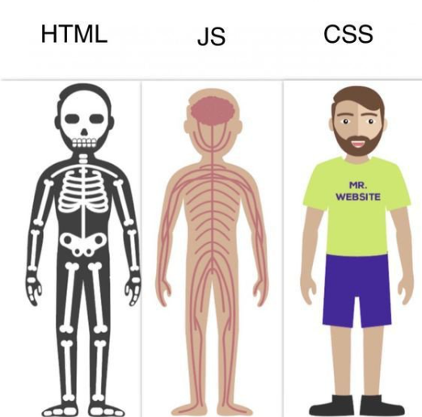
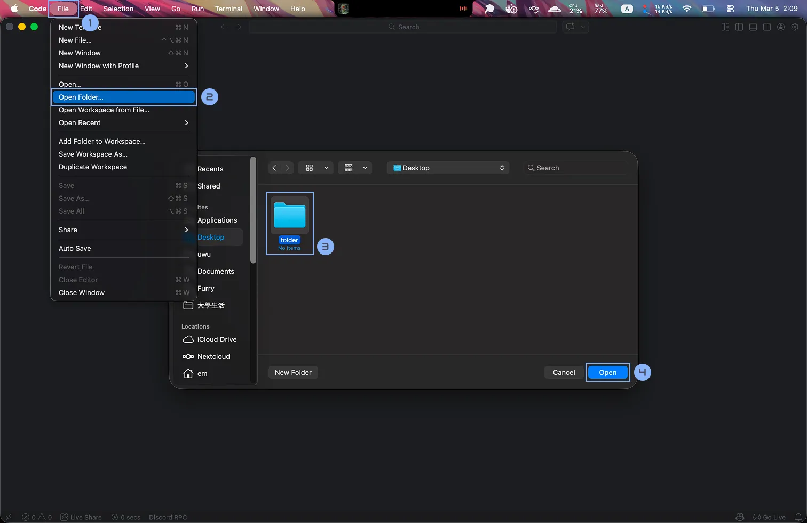
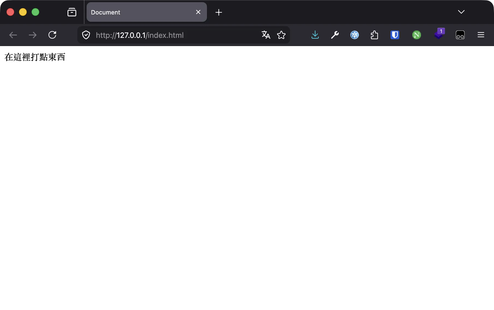

# HTML

環境建置與 HTML 完全指南

毛哥EM



---
layout: statement
class: say
---

<div class="eyebrow">文章教學</div>

這份簡報可以搭配文章一起服用

<div class="qr mt-8">

</div>

<div class="sub mt-4">
<a href="https://emtech.cc/course/frontend/html/">emtech.cc/course/frontend/html</a>
</div>

---
src: ../global/me.md
---

---

<div class="eyebrow">Today</div>

## 今天會講什麼？

<div class="grid grid-cols-3 gap-4 mt-6">
<div class="card">
<ph-wrench class="card-icon" />
<h3>環境建置</h3>
<p class="dim">VS Code<br />Live Server<br />開資料夾、建第一個檔案</p>
</div>
<div class="card">
<ph-text-aa class="card-icon" />
<h3>文字與連結</h3>
<p class="dim">標題、段落、文字裝飾<br />清單、超連結<br />圖片、路徑</p>
</div>
<div class="card">
<ph-layout class="card-icon" />
<h3>結構與互動</h3>
<p class="dim">表格、輸入框、按鈕<br />iframe、audio、video<br />div 與 HTML5 版面</p>
</div>
</div>

---
layout: section
---

<div class="eyebrow">Chapter 01</div>

# 環境建置

---

<div class="eyebrow">Tools</div>

## 寫網站至少需要三個東西

<div class="grid grid-cols-3 gap-4 mt-6">
<div v-click class="card">
<ph-note-pencil class="card-icon" />
<h3>文字編輯器</h3>
<p class="dim">打字的地方</p>
</div>
<div v-click class="card">
<ph-terminal-window class="card-icon" />
<h3>終端機</h3>
<p class="dim">黑底白字看起來像駭客的地方，也是把網頁跑起來的地方</p>
</div>
<div v-click class="card">
<ph-browser class="card-icon" />
<h3>瀏覽器</h3>
<p class="dim">寫完網站總要看吧</p>
</div>
</div>

<p v-click class="lead !mt-8">再加上檔案總管、GitHub Desktop……開一堆軟體太麻煩了。如果有一個<strong>整合式開發環境</strong>（IDE）不是很好嗎？</p>

---

<div class="grid grid-cols-[1fr_1.3fr] gap-10 items-center">
<div>

<div class="eyebrow">IDE</div>

## Visual Studio Code

下載、下一步、下一步、下一步。Mac 就是拖過去，結束。

<p class="dim">官網：<a href="https://code.visualstudio.com/">code.visualstudio.com</a></p>

<p class="muted text-sm !mt-6">有自己習慣的編輯器（Vim、WebStorm）繼續用也沒關係。</p>

</div>

</div>

---

<div class="grid grid-cols-[1fr_1.4fr] gap-10 items-center">
<div>

<div class="eyebrow">Extension</div>

## 安裝 Live Server

<kbd>Ctrl</kbd> + <kbd>Shift</kbd> + <kbd>X</kbd>，或左邊的四個正方形，搜尋「live」。

<p class="dim !mt-4">它會幫你架一個靜態網站伺服器，而且你按 <kbd>Ctrl</kbd> / <kbd>Cmd</kbd> + <kbd>S</kbd> 存檔，畫面就自動重新整理。</p>

</div>

</div>

---

<div class="grid grid-cols-[1fr_1.4fr] gap-10 items-center">
<div>

<div class="eyebrow">Folder</div>

## 開啟資料夾

先找個地方建一個資料夾，再用 VS Code 打開它。

<p class="dim !mt-4">建議建一個大資料夾，裡面每堂課一個資料夾，才不會找不到或很亂。</p>

</div>

</div>

---

<div class="grid grid-cols-[1fr_1.4fr] gap-10 items-center">
<div>

<div class="eyebrow">First Page</div>

## 建立第一個網頁

<ol class="lead">
<li v-click>新增檔案 <code>index.html</code></li>
<li v-click>輸入 <code>!</code> 再按 <kbd>Tab</kbd>，得到 HTML 模板</li>
<li v-click>在 <code>&lt;body&gt;</code> 裡面隨便打點東西</li>
<li v-click>點右下角的 <strong>Go Live</strong></li>
</ol>

</div>

</div>

---

<div class="grid grid-cols-[1fr_1.4fr] gap-10 items-center">
<div>

<div class="eyebrow">It's alive</div>

## 你的網站活起來了！

<p class="lead">瀏覽器會自動打開 <code>127.0.0.1:5500</code>。</p>

<p class="dim !mt-4">之後把 VS Code 放左邊、瀏覽器放右邊，邊寫邊看。</p>

</div>

</div>

---

<div class="eyebrow">Template</div>

## `!` + `Tab` 給你的模板

<div class="grid grid-cols-[1.4fr_1fr] gap-8 items-center">

```html {all|9-11}
<!doctype html>
<html lang="en">
	<head>
		<meta charset="UTF-8" />
		<meta name="viewport" content="width=device-width, initial-scale=1.0" />
		<title>Document</title>
	</head>
	<body>
		在這裡打點
		<b>很粗的東西</b>
	</body>
</html>
```

<div>
<p class="lead">現在先不用看懂。</p>
<p class="dim">你只要知道：等一下我們都打在 <code>&lt;body&gt;</code> 跟 <code>&lt;/body&gt;</code> 之間。</p>
</div>
</div>

---
layout: section
---

<div class="eyebrow">Chapter 02</div>

# HTML 語法

---
layout: statement
class: say
---

<div class="eyebrow">HyperText Markup Language</div>

HTML 的目的不是裝飾

<p v-click>是讓<strong>瀏覽器和使用者知道這是什麼</strong>。</p>

<p v-click class="sub !mt-6">Google 會找 <code>&lt;h1&gt;</code> 當標題；語音閱讀器看到 <code>&lt;strong&gt;</code> 會加重語氣。裝飾是 CSS 的工作。</p>

---

<div class="eyebrow">Element</div>

## 網站所有東西都是由元素組成


<p class="dim text-center !mt-4">前面是開頭，後面有個 <code>/</code> 就是結束。</p>

---

<div class="eyebrow">Heading</div>

## 標題

<div class="grid grid-cols-2 gap-8 items-center">

```html
<h1>Heading 1</h1>
<h2>Heading 2</h2>
<h3>Heading 3</h3>
<h4>Heading 4</h4>
<h5>Heading 5</h5>
<h6>Heading 6</h6>
```

<div class="preview">
<h1>Heading 1</h1>
<h2>Heading 2</h2>
<h3>Heading 3</h3>
<h4>Heading 4</h4>
<h5>Heading 5</h5>
<h6>Heading 6</h6>
</div>
</div>

<p class="muted !mt-4">從 <code>&lt;h1&gt;</code> 開始依序使用：<code>&lt;h1&gt;</code> 底下才有 <code>&lt;h2&gt;</code>，然後才有 <code>&lt;h3&gt;</code>。</p>

---
layout: statement
class: say
---

&gt;&lt; 好麻煩 /

<p v-click class="muted">小於、h、1、大於、標題、小於、斜線、大於……</p>

---

<div class="grid grid-cols-[1fr_260px] gap-12 items-center">
<div>

<div class="eyebrow">Emmet</div>

## 工程師都很懶

<p class="lead">打 <code>h1</code> 再按 <kbd>Tab</kbd>，就會變成 <code>&lt;h1&gt;&lt;/h1&gt;</code>。</p>

<div class="table-clean mt-6">

| 輸入      | 按 Tab 之後                 |
| --------- | --------------------------- |
| `h1`      | `<h1></h1>`                 |
| `ul>li*3` | 一個 `<ul>` 裡面三個 `<li>` |
| `!`       | 整份 HTML 模板              |

</div>
</div>
<div class="text-center">

<p class="muted text-sm !mt-2">Сергей Чикуёнок，發明了 Emmet</p>
</div>
</div>

---

<div class="eyebrow">Text</div>

## 文字裝飾

<div class="grid grid-cols-[1fr_1fr_1fr] gap-6 items-center">

```html
<p>
	段落
	<b>粗體</b>
	<i>斜體</i>
	<s>刪除線</s>
	<u>底線</u>
	H
	<sup>+</sup>
	CO
	<sub>2</sub>
</p>
```

<div class="table-clean text-sm">

| 元素    | 英文        |
| ------- | ----------- |
| `<p>`   | paragraph   |
| `<b>`   | bold        |
| `<i>`   | italic      |
| `<s>`   | strike      |
| `<u>`   | underline   |
| `<sup>` | superscript |
| `<sub>` | subscript   |

</div>

<div class="preview">
<p>段落 <b>粗體</b> <i>斜體</i> <s>刪除線</s> <u>底線</u> H<sup>+</sup> CO<sub>2</sub></p>
</div>
</div>

<p class="muted !mt-4">super 在上面；訂閱按鈕 Subscribe 在影片下方等你去按。</p>

---

<div class="eyebrow">List</div>

## 無序清單與有序清單

<div class="grid grid-cols-[1fr_1fr_0.8fr] gap-6 items-center">

```html
<ul>
	<li>a</li>
	<li>b</li>
	<li>c</li>
</ul>
```

```html
<ol>
	<li>a</li>
	<li>b</li>
	<li>c</li>
</ol>
```

<div class="preview">
<ul><li>a</li><li>b</li><li>c</li></ul>
<ol><li>a</li><li>b</li><li>c</li></ol>
</div>
</div>

<p class="muted !mt-4">Emmet：<code>ul>li*3</code> + <kbd>Tab</kbd> 一次完成。</p>

---

<div class="eyebrow">Nested List</div>

## 清單裡可以有清單

<div class="grid grid-cols-[1.3fr_1fr] gap-8 items-center">

```html
<ul>
	<li>玉米濃湯</li>
	<li>鮪魚吐司</li>
	<li>
		薯條
		<ul>
			<li>鹽味</li>
			<li>胡椒鹽</li>
			<li>番茄醬</li>
		</ul>
	</li>
</ul>
```

<div class="preview">
<ul>
<li>玉米濃湯</li>
<li>鮪魚吐司</li>
<li>薯條
<ul><li>鹽味</li><li>胡椒鹽</li><li>番茄醬</li></ul>
</li>
</ul>
</div>
</div>

---

<div class="eyebrow">Whitespace</div>

## 空白與換行

<div class="grid grid-cols-2 gap-8 items-center">
<div>

<p class="lead">一個以上的 tab、空格、換行，都只算<strong>一個空格</strong>。</p>

<p class="dim">要換行用 <code>&lt;br /&gt;</code>，要分隔線用 <code>&lt;hr /&gt;</code>（Horizontal Rule）。</p>

```html
橫線
<hr />
換行
<br />
文字
```

</div>
<div>
<div class="preview">
橫線
<hr />
換行
<br />
文字
</div>

<p v-click class="dim !mt-6">程式碼亂了？<kbd>Alt</kbd> + <kbd>Shift</kbd> + <kbd>F</kbd>（Mac：<kbd>Option</kbd> + <kbd>Shift</kbd> + <kbd>F</kbd>）自動格式化。</p>
</div>
</div>

---

<div class="eyebrow">Link</div>

## 超連結

<div class="grid grid-cols-[1.4fr_1fr] gap-8 items-center">
<div>

```html
<a href="連結">顯示文字</a>
```

```html
<a href="https://www.google.com">Google</a>
```

</div>
<div>
<p class="lead"><code>&lt;a&gt;</code>：anchor 錨點</p>
<p class="dim"><code>href</code>：hypertext reference</p>
<div class="preview mt-4"><a href="https://www.google.com">Google</a></div>
</div>
</div>

---

<div class="eyebrow">Attribute</div>

## 屬性：HTML 唯一的一個 feature

```html
<元素名稱 屬性="屬性值">內容</元素名稱>
```

<div class="grid grid-cols-2 gap-6 mt-6">
<div v-click class="card">
<h3>新分頁開啟</h3>

```html
<a href="https://emtech.cc" target="_blank">毛哥EM</a>
```

</div>
<div v-click class="card">
<h3>跳到同一頁的某個位置</h3>

```html
<a href="#image">跑去圖片</a>
<h3 id="image">圖片</h3>
```

</div>
</div>

---

<div class="eyebrow">Image</div>

## 圖片

<div class="grid grid-cols-[1.5fr_1fr] gap-8 items-center">
<div>

```html

```

```html

```

</div>
<div>
<p class="dim"><code>src</code>：source 來源</p>
<p class="dim"><code>alt</code>：alternative text。圖片壞掉時顯示，Google 和語音閱讀器也靠它理解圖片。</p>
<div class="preview mt-4 text-center"></div>
</div>
</div>

<p v-click class="muted !mt-4">東西大多都可以包在連結裡：把 <code>&lt;img&gt;</code> 放進 <code>&lt;a&gt;</code>，圖片就能點了。</p>

---

<div class="eyebrow">Path</div>

## 相對路徑與絕對路徑

<div class="grid grid-cols-[220px_1fr] gap-10 items-center">

```text
├── about
│   └── index.html
├── img
│   └── image.png
├── index.html
└── logo.png
```

<div class="table-clean">

| 我在               | 我要寫                       | 意思               |
| ------------------ | ---------------------------- | ------------------ |
| `index.html`       | `./logo.png`                 | 同一個資料夾       |
| `index.html`       | `./img/image.png`            | 進 img 資料夾      |
| `about/index.html` | `../logo.png`                | 往外一層           |
| 任何地方           | `/logo.png`                  | 從網站根目錄開始算 |
| 任何地方           | `https://emtech.cc/logo.png` | 絕對路徑           |

</div>
</div>

---

<div class="eyebrow">Table</div>

## 表格

<div class="grid grid-cols-[1fr_1.1fr] gap-8 items-center">
<div class="code-sm">

```html
<table>
	<tr>
		<th>國家</th>
		<th>首都</th>
		<th>人口</th>
	</tr>
	<tr>
		<td>USA</td>
		<td>Washington D.C.</td>
		<td>309 million</td>
	</tr>
	<tr>
		<td>Sweden</td>
		<td>Stockholm</td>
		<td>9 million</td>
	</tr>
</table>
```

</div>
<div>
<div class="preview">
<table>
<tr><th>國家</th><th>首都</th><th>人口</th></tr>
<tr><td>USA</td><td>Washington D.C.</td><td>309 million</td></tr>
<tr><td>Sweden</td><td>Stockholm</td><td>9 million</td></tr>
</table>
</div>
<p class="dim !mt-4"><code>tr</code> table row、<code>td</code> table data、<code>th</code> table header</p>
</div>
</div>

---

<div class="eyebrow">Table</div>

## 表格的結構與合併儲存格

<div class="grid grid-cols-2 gap-8 items-center">
<div class="code-sm">

```html
<table>
	<thead>
		<tr>
			<th>項目</th>
			<th>金額</th>
		</tr>
	</thead>
	<tbody>
		<tr>
			<td>AirPods</td>
			<td>$6,490</td>
		</tr>
		<tr>
			<td>iPad Pro</td>
			<td>$25,900</td>
		</tr>
	</tbody>
	<tfoot>
		<tr>
			<th>總金額</th>
			<td>$32,390</td>
		</tr>
	</tfoot>
</table>
```

<p class="dim">讓瀏覽器和搜尋引擎看懂表格結構。</p>

</div>
<div class="code-sm">

```html
<tr>
	<td>4</td>
	<td>5</td>
	<td rowspan="2">6</td>
</tr>
<tr>
	<td colspan="2">7</td>
</tr>
```

<div class="preview mt-2 inline-block">
<table>
<tr><th>1</th><th>2</th><th>3</th></tr>
<tr><td>4</td><td>5</td><td rowspan="2">6</td></tr>
<tr><td colspan="2">7</td></tr>
</table>
</div>
</div>
</div>

---

<div class="eyebrow">Input</div>

## 輸入框

<div class="grid grid-cols-[1.4fr_1fr] gap-x-8 gap-y-3 items-center code-sm">

```html
<input type="text" value="Hello World!" />
```

<div class="preview"><input type="text" value="Hello World!" /></div>

```html
<input type="password" />
```

<div class="preview"><input type="password" value="hunter2" /></div>

```html
<input type="checkbox" />
To-do
```

<div class="preview"><input type="checkbox" /> To-do</div>

```html
<input type="radio" name="color" value="red" />
red
<input type="radio" name="color" value="green" />
green
```

<div class="preview"><input type="radio" name="demo-color" value="red" /> red <input type="radio" name="demo-color" value="green" /> green</div>
</div>

<p class="muted !mt-4">radio 跟收音機一樣一次只能聽一個頻道。同一組要用同一個 <code>name</code>。</p>

---

<div class="eyebrow">Interactive</div>

## 按鈕、嵌入、影音

<div class="grid grid-cols-2 gap-5 mt-2 code-sm">
<div class="card">
<h3>button</h3>

```html
<button>Click me!</button>
```

<p class="dim">還不會 JavaScript，先當舒壓玩具。</p>
</div>
<div class="card">
<h3>iframe：嵌入別的網頁</h3>

```html
<iframe src="https://www.youtube-nocookie.com/embed/IxX_QHay02M"></iframe>
```

</div>
<div class="card">
<h3>audio</h3>

```html
<audio src="song.mp3" controls></audio>
```

</div>
<div class="card">
<h3>video</h3>

```html
<video src="fish.mp4" controls></video>
```

</div>
</div>

<p class="muted !mt-4">加上 <code>controls</code> 屬性，才會出現播放器讓使用者控制。</p>

---

<div class="eyebrow">div</div>

## 把東西包成一個區塊

<div class="grid grid-cols-2 gap-8 items-center">

```html
<div>
	<h2>注意</h2>
	<p>感謝你的注意</p>
</div>
```

<div>
<p class="lead">網站通常會分成標題、導覽列、內容、側邊欄、頁尾……</p>
<p class="dim"><code>&lt;div&gt;</code> 本身沒有任何視覺效果，只是把元素群組起來，方便之後用 CSS 排版。</p>
</div>
</div>

---

<div class="eyebrow">HTML5</div>

## 有意義的版面元素

<div class="grid grid-cols-[1fr_1.1fr] gap-8 items-center">
<div class="code-sm">

```html
<header>
	<h1>網站標題</h1>
</header>
<nav>
	<a href="#">連結 1</a>
	<a href="#">連結 2</a>
</nav>
<main>
	<article>
		<h2>第一篇文章</h2>
		<p>文章內容</p>
	</article>
	<aside>側邊欄</aside>
</main>
<footer>網站頁尾</footer>
```

</div>
<div>
<p class="lead">跟 <code>&lt;div&gt;</code> 一樣沒有視覺效果，但告訴瀏覽器和搜尋引擎<strong>這個區塊是做什麼的</strong>。</p>
<p v-click class="dim !mt-4">盲人跟 Google 會愛你。</p>
</div>
</div>

---
layout: statement
class: say
---

<div class="eyebrow">Recap</div>

這些已經是最常用的元素了

<p class="sub !mt-4">想知道更多：<a href="https://developer.mozilla.org/zh-TW/docs/Web/HTML/Element">MDN HTML 元素參考</a></p>

<p v-click class="!mt-10">下一堂：用 CSS 把網頁變好看。</p>

---
src: ../global/cc.md
---
